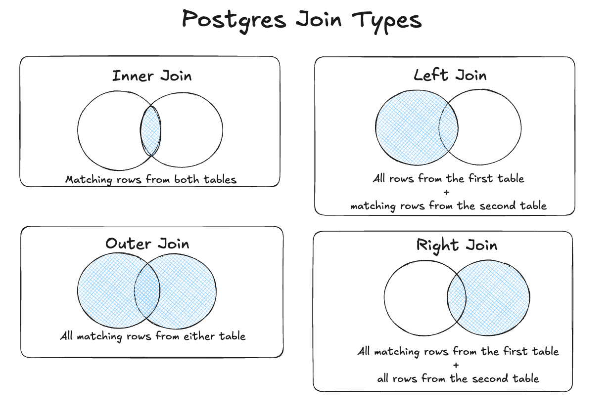
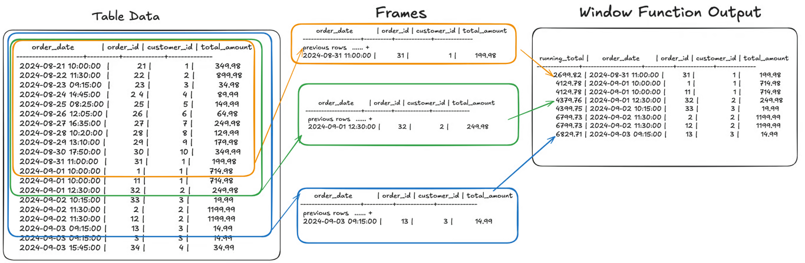
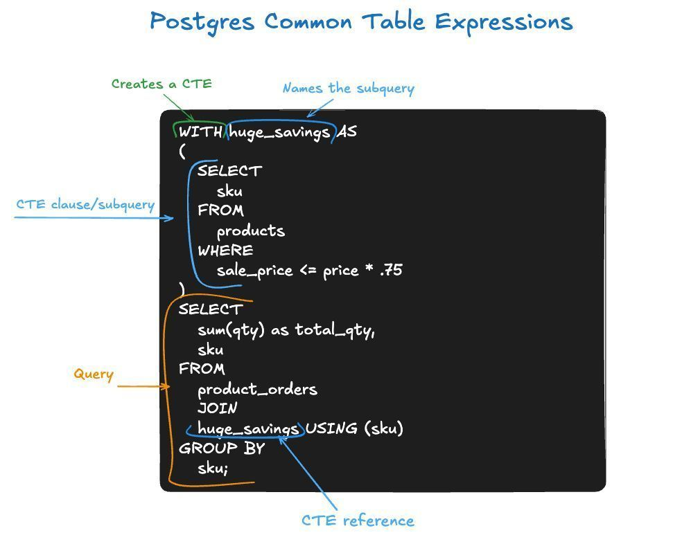

autoscale: true

[.background-color: #336791]
[.footer: Slide 1 / 59]

## Getting Started with SQL in Postgres
<br>
<br>
### Hour 2 of PostgreSQL Training Day
### SCaLE LA 2026

---

[.background-color: #336791]
[.footer: Slide 2 / 59]

## Hour 2 Topics

[.column]

- Basic CRUD operations
- JOIN types
- Arrays and JSON
- Window functions
- CTEs (Common Table Expressions)
- PL/pgSQL functions
- Text Search

[.column]

**Training Materials**

**github.com/Snowflake-Labs/postgres-full-day-training**


---

[.background-color: #8B4513]
[.footer: Slide 3 / 59]

## What is CRUD?

**C**reate - `INSERT` new rows
**R**ead - `SELECT` existing data
**U**pdate - `UPDATE` existing rows
**D**elete - `DELETE` rows

These four operations cover nearly all data manipulation (DML)!

---

[.background-color: #8B4513]
[.footer: Slide 4 / 59]

## SELECT - Reading Data

```sql
SELECT title, release_date, vote_average
FROM bluebox.film
WHERE release_date >= '2020-01-01'
ORDER BY vote_average DESC
LIMIT 5;
```

```
                  title                  | release_date | vote_average 
-----------------------------------------+--------------+--------------
 Renaissance: A Film by Beyoncé          | 2023-12-01   |          8.7
 Thriller 40                             | 2023-12-02   |          8.7
 Three Wise Men and a Baby               | 2022-11-19   |          8.7
 Taylor Swift City of Lover Concert      | 2020-05-18   |          8.6
 Folklore: The Long Pond Studio Sessions | 2020-11-25   |          8.6
```

---

[.background-color: #8B4513]
[.footer: Slide 5 / 59]

## What are Aggregates?

Functions that combine multiple rows into a single result

| Function | Purpose |
|----------|---------|
| `COUNT(*)` | Number of rows |
| `SUM(col)` | Total of values |
| `AVG(col)` | Average value |
| `MIN(col)` | Smallest value |
| `MAX(col)` | Largest value |
| `STRING_AGG(col, ',')` | Concatenate strings |
| `ARRAY_AGG(col)` | Collect into array |

Use with `GROUP BY` to aggregate per group

---

[.background-color: #8B4513]
[.footer: Slide 6 / 59]

## SELECT with Aggregates

```sql
SELECT 
    EXTRACT(year FROM release_date) as release_year,
    COUNT(*) as film_count,
    ROUND(AVG(vote_average)::numeric, 2) as avg_rating
FROM bluebox.film
WHERE release_date IS NOT NULL
GROUP BY release_year
HAVING COUNT(*) > 100
ORDER BY release_year DESC LIMIT 5;
```

```
 release_year | film_count | avg_rating 
--------------+------------+------------
         2023 |        157 |       6.97
         2022 |        242 |       6.86
         2021 |        288 |       6.83
         2020 |        235 |       6.79
         2019 |        261 |       6.80
```

---

[.background-color: #8B4513]
[.footer: Slide 7 / 59]

## INSERT - Creating Data

```sql
INSERT INTO bluebox.customer (
    customer_id, store_id, full_name, email, zip_code 
)
VALUES (
    999999, 1, 'Jane Smith', 'jane.smith@example.com', 90210
);
```

`INSERT 0 1` = Success! (0 is legacy OID, 1 is rows inserted)

---

[.background-color: #8B4513]
[.footer: Slide 8 / 59]

## INSERT - What Happens Without Required Fields?

```sql
-- This looks simpler, but will it work?
INSERT INTO bluebox.customer (store_id, full_name, email)
VALUES (1, 'Bob Jones', 'bob@example.com');
```

```
ERROR: null value in column "customer_id" 
       violates not-null constraint
```

The table has constraints that protect data integrity!

---

[.background-color: #8B4513]
[.footer: Slide 9 / 59]

## Constraints Protect Your Data

Bluebox `customer` table constraints:

| Column | Constraint | Why it matters |
|--------|-----------|----------------|
| `customer_id` | NOT NULL | No auto-increment here! |
| `store_id` | NOT NULL + FK | Must reference existing store |
| `full_name` | NOT NULL | Every customer needs a name |
| `zip_code` | FK | Must exist in `zip_code_info` |

Constraints catch bad data at the database level — not in app code!

---

[.background-color: #8B4513]
[.footer: Slide 10 / 59]

## UPDATE - Modifying Data

```sql
-- Update with conditions
UPDATE bluebox.customer
SET email = 'newemail@example.com'
WHERE customer_id = 100;

-- no such film id, so update does nothing
-- Update multiple columns
UPDATE bluebox.film
SET vote_average = 8.5
WHERE film_id = 550;
```

---

[.background-color: #8B4513]
[.footer: Slide 11 / 59]

## DELETE - Removing Data

```sql
-- This works! payment has no child tables referencing it
DELETE FROM bluebox.payment 
WHERE payment_id = 1
RETURNING *;
```

```sql
-- This fails! film has inventory rows referencing it
DELETE FROM bluebox.film 
WHERE film_id = 1472668;
```

```
ERROR: update or delete on table "film" violates foreign key 
constraint "inventory_film_id_fkey" on table "inventory"
DETAIL: Key (film_id)=(1472668) is referenced from table "inventory".
```

---

[.background-color: #8B4513]
[.footer: Slide 12 / 59]

## DELETE - Working with Constraints

```sql
-- Option 1: Delete the referencing rows first
DELETE FROM bluebox.inventory WHERE film_id = 1472668;
DELETE FROM bluebox.film WHERE film_id = 1472668;

-- Option 2: Define FK with ON DELETE CASCADE (auto-deletes children)
ALTER TABLE bluebox.inventory 
DROP CONSTRAINT inventory_film_id_fkey,
ADD CONSTRAINT inventory_film_id_fkey 
    FOREIGN KEY (film_id) REFERENCES bluebox.film(film_id)
    ON DELETE CASCADE;

-- Now deleting a film removes its inventory automatically!
DELETE FROM bluebox.film WHERE film_id = 1472668;
```

---

[.background-color: #8B4513]
[.footer: Slide 13 / 59]

## Constraints

Rules that enforce data integrity at the database level

| Constraint | Purpose |
|------------|---------|
| `PRIMARY KEY` | Unique identifier for each row |
| `FOREIGN KEY` | Links to another table's primary key |
| `NOT NULL` | Column must have a value |
| `UNIQUE` | No duplicate values allowed |
| `CHECK` | Custom validation rules |
| `DEFAULT` | Auto-fill value if none provided |

^ Constraints catch bad data before it enters your database - not in application code!

---

[.background-color: #8B4513]
[.footer: Slide 14 / 59]

#### Constraints: WITHOUT OVERLAPS (new PG 18)

Prevent double-bookings with temporal constraints:

```sql
-- Required for WITHOUT OVERLAPS on non-range types
CREATE EXTENSION IF NOT EXISTS btree_gist;

-- Create a rental booking table
CREATE TABLE bluebox.rental_booking (
    booking_id SERIAL,
    film_id INT NOT NULL,
    rental_period DATERANGE NOT NULL,
    customer_id INT NOT NULL,
    PRIMARY KEY (film_id, rental_period WITHOUT OVERLAPS)
);

-- First booking succeeds
INSERT INTO rental_booking (film_id, rental_period, customer_id)
VALUES (1, '[2025-03-01, 2025-03-05)', 101);

-- Overlapping booking fails automatically!
INSERT INTO rental_booking (film_id, rental_period, customer_id)
VALUES (1, '[2025-03-03, 2025-03-07)', 102);
-- ERROR: conflicting key value violates exclusion constraint
```

No more double-booked rentals!

---

[.background-color: #2F4F4F]
[.footer: Slide 15 / 59]

## RETURNING Clause

Get data back from INSERT, UPDATE, or DELETE!

```sql
INSERT INTO bluebox.customer (customer_id, store_id, full_name, email)
VALUES (999998, 1, 'Charlie Wilson', 'charlie@example.com')
RETURNING customer_id, create_date;
```

```
 customer_id | create_date 
-------------+-------------
      999998 | 2026-02-16
```

---

[.background-color: #2F4F4F]
[.footer: Slide 16 / 59]

## RETURNING OLD/NEW (PG 18)

See both before and after values in one statement!

```sql
UPDATE bluebox.film 
SET vote_average = 8.6 
WHERE film_id = 155
RETURNING OLD.vote_average AS before, NEW.vote_average AS after, title;
```

```
 before | after |      title       
--------+-------+------------------
    8.5 |   8.6 | The Dark Knight
```

No more separate SELECT to see what changed!

---

[.background-color: #2F4F4F]
[.footer: Slide 17 / 59]

## UPSERT with ON CONFLICT

Insert or update if row already exists:

```sql
INSERT INTO bluebox.customer (customer_id, store_id, full_name, email)
VALUES (100, 1, 'Updated Name', 'updated@example.com')
ON CONFLICT (customer_id) 
DO UPDATE SET 
    full_name = EXCLUDED.full_name,
    email = EXCLUDED.email;
```

`EXCLUDED` refers to the values that would have been inserted

---

[.background-color: #006400]
[.footer: Slide 18 / 59]



---

[.background-color: #006400]
[.footer: Slide 19 / 59]

## INNER JOIN

Returns only matching rows from both tables

```sql
SELECT f.title, p.name as actor
FROM bluebox.film f
INNER JOIN bluebox.film_cast fc ON f.film_id = fc.film_id
INNER JOIN bluebox.person p ON fc.person_id = p.person_id
WHERE f.title = 'The Dark Knight'
LIMIT 3;
```

```
      title      |      actor       
-----------------+------------------
 The Dark Knight | Gary Oldman
 The Dark Knight | Morgan Freeman
 The Dark Knight | William Fichtner
```

---

[.background-color: #006400]
[.footer: Slide 20 / 59]

## LEFT JOIN

Returns all rows from left table, matching from right (NULLs if no match)

```sql
-- Find films and their cast count (including films with no cast)
SELECT f.title, COUNT(fc.person_id) as cast_count
FROM bluebox.film f
LEFT JOIN bluebox.film_cast fc ON f.film_id = fc.film_id
GROUP BY f.film_id, f.title
ORDER BY cast_count DESC LIMIT 5;
```

```
               title                | cast_count
------------------------------------+------------
 Bring It On: Worldwide #Cheersmack |        451
 Malcolm X                          |        348
 Around the World in Eighty Days    |        313
 And the Oscar Goes To...           |        258
 Enchanted                          |        247
(5 rows)
```

---

[.background-color: #006400]
[.footer: Slide 21 / 59]

## RIGHT JOIN

Returns all rows from right table, matching from left, with NULL for any missing matches.

```sql
-- Same query rewritten - RIGHT JOIN is rarely used
-- Most prefer to swap tables and use LEFT JOIN instead
SELECT f.title, COUNT(fc.person_id) as cast_count
FROM bluebox.film_cast fc
RIGHT JOIN bluebox.film f ON fc.film_id = f.film_id
GROUP BY f.film_id, f.title;
```

💡 Tip: RIGHT JOIN can always be rewritten as LEFT JOIN

---

[.background-color: #006400]
[.footer: Slide 22 / 59]

## FULL OUTER JOIN

Returns all rows from both tables (NULLs on both sides if no match)

```sql
-- Find people who are actors OR crew (or both)
SELECT p.name,
    CASE WHEN fc.person_id IS NOT NULL THEN 'Actor' END as is_actor,
    CASE WHEN fcr.person_id IS NOT NULL THEN 'Crew' END as is_crew
FROM (SELECT DISTINCT person_id FROM bluebox.film_cast) fc
FULL OUTER JOIN (SELECT DISTINCT person_id FROM bluebox.film_crew) fcr 
    ON fc.person_id = fcr.person_id
JOIN bluebox.person p 
    ON p.person_id = COALESCE(fc.person_id, fcr.person_id)
ORDER BY p.name
LIMIT 5;
```

---

[.background-color: #006400]
[.footer: Slide 23 / 59]

## Multiple JOINs

Chain JOINs to connect normalized data across several tables

```sql
-- Find cast of The Dark Knight
-- film → film_cast → person (3 tables connected)
SELECT f.title, p.name as actor, fc.film_character
FROM bluebox.film f
JOIN bluebox.film_cast fc ON f.film_id = fc.film_id
JOIN bluebox.person p ON fc.person_id = p.person_id
WHERE f.title = 'The Dark Knight'
LIMIT 5;
```

```
      title      |       actor       | film_character 
-----------------+-------------------+----------------
 The Dark Knight | Gary Oldman       | James Gordon
 The Dark Knight | Morgan Freeman    | Lucius Fox
 The Dark Knight | Heath Ledger      | Joker
 The Dark Knight | Maggie Gyllenhaal | Rachel Dawes
 The Dark Knight | William Fichtner  | Bank Manager
```

---

[.background-color: #191970]
[.footer: Slide 24 / 59]

## Arrays and JSON

---

[.background-color: #191970]
[.footer: Slide 25 / 59]

## Arrays in PostgreSQL

Bluebox stores genre IDs as an array on each film:

```sql
SELECT film_id, title, genre_ids 
FROM bluebox.film 
WHERE title = 'The Dark Knight';
```

```
 film_id |      title      |   genre_ids   
---------+-----------------+---------------
     155 | The Dark Knight | {18,28,80,53}
```

```sql
-- What do these IDs mean? Check the film_genre table
SELECT genre_id, name FROM bluebox.film_genre 
WHERE genre_id IN (18, 28, 80, 53);
```

Drama (18), Action (28), Crime (80), Thriller (53)

---

[.background-color: #191970]
[.footer: Slide 26 / 59]

## Adding to an Array

```sql
-- Add a genre to a film's array
UPDATE bluebox.film
SET genre_ids = genre_ids || ARRAY[9648]  -- Add Mystery
WHERE film_id = 155;

-- Alternative: array_append function
UPDATE bluebox.film
SET genre_ids = array_append(genre_ids, 9648)
WHERE film_id = 155;
```

---

[.background-color: #191970]
[.footer: Slide 27 / 59]

## Array Operators

| Operator | Meaning | Example |
|----------|---------|---------|
| `= ANY()` | Contains value | `28 = ANY(genre_ids)` |
| `@>` | Contains all | `genre_ids @> ARRAY[28,80]` |
| `<@` | Is contained by | `ARRAY[28] <@ genre_ids` |
| `&&` | Overlaps (any match) | `genre_ids && ARRAY[28,35]` |
| (double pipe) | Concatenate | `genre_ids` + `ARRAY[9648]` |
| `[n]` | Access element | `genre_ids[1]` (1-indexed!) |

---

[.background-color: #191970]
[.footer: Slide 28 / 59]

## Querying Arrays

```sql
-- Find Action films
-- = ANY() checks if value exists anywhere in the array
SELECT f.title
FROM bluebox.film f
JOIN bluebox.film_genre fg ON fg.genre_id = ANY(f.genre_ids)
WHERE fg.name = 'Action'
LIMIT 3;

-- Find films that are both Action AND Crime
-- @> checks if array contains ALL specified values
SELECT title FROM bluebox.film f
WHERE genre_ids @> ARRAY(
    SELECT genre_id FROM bluebox.film_genre 
    WHERE name IN ('Action', 'Crime')
) LIMIT 3;

-- Unnest: expand array to rows (list all genres for a film)
SELECT f.title, g.name as genre
FROM bluebox.film f, unnest(f.genre_ids) as gid
JOIN bluebox.film_genre g ON g.genre_id = gid
WHERE f.title = 'The Dark Knight';
```

---

[.background-color: #191970]
[.footer: Slide 29 / 59]

## JSON vs JSONB

| Feature | JSON | JSONB |
|---------|------|-------|
| Storage | Text (as-is) | Binary (parsed) |
| Insert speed | Faster | Slower |
| Query speed | Slower | **Much faster** |
| Indexing | ❌ No | ✅ GIN indexes |
| Preserves order | ✅ Yes | ❌ No |
| Duplicate keys | Preserved | Last value wins |

**Always use JSONB** unless you need exact JSON preservation

---

[.background-color: #191970]
[.footer: Slide 30 / 59]

## Working with JSONB

[.column]

```sql
-- Create table with JSONB
CREATE TABLE movie_metadata (
    movie_id INT PRIMARY KEY,
    data JSONB
);

-- Insert JSON data
INSERT INTO movie_metadata (movie_id, data)
VALUES (1, '{
    "director": "Christopher Nolan",
    "budget": 160000000,
    "awards": ["Oscar", "BAFTA"]
}');


[.column]

-- Different row, completely different structure - that's OK!
INSERT INTO movie_metadata (movie_id, data)
VALUES (2, '{
    "streaming": ["Netflix", "Hulu"],
    "runtime_minutes": 148,
    "has_sequel": true
}');
```

No schema enforcement - each row can have different structures!

---

[.background-color: #191970]
[.footer: Slide 31 / 59]

## JSONB Operators

| Operator | Meaning | Example |
|----------|---------|---------|
| `->` | Get as JSON | `data->'awards'` |
| `->>` | Get as TEXT | `data->>'director'` |
| `#>` | Get path as JSON | `data#>'{awards,0}'` |
| `#>>` | Get path as TEXT | `data#>>'{awards,0}'` |
| `?` | Key exists? | `data ? 'budget'` |
| `?&` | All keys exist? | `data ?& array['a','b']` |
| `@>` | Contains? | `data @> '{"x":1}'` |

---

[.background-color: #191970]
[.footer: Slide 32 / 59]

## Querying JSONB

```sql
-- Extract value as text (most common)
SELECT data->>'director' as director
FROM movie_metadata;

-- Extract nested value (awards array, first item)
SELECT data->'awards'->>0 as first_award
FROM movie_metadata;

-- Check if key exists
SELECT * FROM movie_metadata
WHERE data ? 'budget';

-- Query by JSON value (containment)
SELECT * FROM movie_metadata
WHERE data @> '{"director": "Christopher Nolan"}';
```

---

[.background-color: #800020]
[.footer: Slide 33 / 59]

## Window Functions

Perform calculations across related rows **without grouping**

- **Running totals** - cumulative sums as you go down rows
- **LAG / LEAD** - access previous or next row's values
- **ROW_NUMBER** - assign sequential numbers to rows
- **RANK / DENSE_RANK** - rank rows with tie handling
- **PARTITION BY** - restart calculations for each group

Key difference from GROUP BY: window functions keep all rows!

---

[.background-color: #FFFFFF]
[.footer: Slide 34 / 59]



---

[.background-color: #800020]
[.footer: Slide 35 / 59]

## Running Totals

```sql
SELECT 
    payment_date::date,
    amount,
    SUM(amount) OVER (
        ORDER BY payment_date
    ) as running_total
FROM bluebox.payment
WHERE customer_id = 53853
ORDER BY payment_date;
```

```
 payment_date | amount | running_total 
--------------+--------+---------------
 2025-03-05   |   1.99 |          1.99
 2025-06-07   |   7.96 |          9.95
 2025-06-28   |   7.96 |         17.91
```

---

[.background-color: #800020]
[.footer: Slide 36 / 59]

## LAG - Compare to Previous Row

```sql
SELECT 
    payment_date::date,
    amount,
    LAG(amount) OVER (ORDER BY payment_date) as prev_amount,
    amount - LAG(amount) OVER (ORDER BY payment_date) as difference
FROM bluebox.payment
WHERE customer_id = 53853
ORDER BY payment_date;
```

```
 payment_date | amount | prev_amount | difference 
--------------+--------+-------------+------------
 2025-03-05   |   1.99 |      [NULL] |     [NULL]
 2025-06-07   |   7.96 |        1.99 |       5.97
 2025-06-28   |   7.96 |        7.96 |       0.00
```

---

[.background-color: #800020]
[.footer: Slide 37 / 59]

## LEAD - Look Ahead

```sql
SELECT 
    title,
    release_date,
    LEAD(title) OVER (ORDER BY release_date) as next_film,
    LEAD(release_date) OVER (ORDER BY release_date) as next_release
FROM bluebox.film
WHERE release_date >= '2023-01-01'
ORDER BY release_date
LIMIT 5;
```

`LEAD` looks forward, `LAG` looks backward

---

[.footer: Slide 38 / 59]


## CTEs - Common Table Expressions

- Improve readability
- Can be referenced multiple times
- Great for breaking down complex queries


---

[.background-color: #CC5500]
[.footer: Slide 39 / 59]



---

[.background-color: #CC5500]
[.footer: Slide 40 / 59]

## CTE: Calculate Once, Use Multiple Times

```sql
WITH customer_totals AS (
    SELECT customer_id, SUM(amount) as total_spent
    FROM bluebox.payment
    GROUP BY customer_id
)
SELECT 
    c.full_name,
    ct.total_spent,
    ROUND((SELECT AVG(total_spent) FROM customer_totals), 2) as avg_spent
FROM customer_totals ct
JOIN bluebox.customer c ON ct.customer_id = c.customer_id
WHERE ct.total_spent > (SELECT AVG(total_spent) FROM customer_totals)
ORDER BY ct.total_spent DESC LIMIT 5;
```

```
        full_name        | total_spent | avg_spent 
-------------------------+-------------+-----------
 Dr. Doris Abshire DDS   |      111.44 |     36.60
 Mr. Theodore Willms V   |      107.46 |     36.60
 Mrs. Ezequiel Orn I     |      107.46 |     36.60
```

The CTE `customer_totals` is referenced **3 times** - that's the power!

---

[.background-color: #CC5500]
[.footer: Slide 41 / 59]

## Multiple CTEs

Build up logic step-by-step: aggregate → filter → select

```sql
WITH 
yearly_stats AS (
    -- Step 1: Aggregate films by year
    SELECT EXTRACT(year FROM release_date)::int as year,
           COUNT(*) as film_count,
           ROUND(AVG(vote_average)::numeric, 2) as avg_rating
    FROM film
    WHERE release_date IS NOT NULL AND vote_average IS NOT NULL
    GROUP BY EXTRACT(year FROM release_date)
),
top_years AS (
    -- Step 2: Filter to busy years, rank by rating
    SELECT * FROM yearly_stats
    WHERE film_count > 50
    ORDER BY avg_rating DESC LIMIT 5
)
SELECT * FROM top_years;
```

```
 year | film_count | avg_rating 
------+------------+------------
 2023 |        157 |       6.97
 2022 |        242 |       6.86
 2021 |        288 |       6.83
```

---

[.background-color: #556B2F]
[.footer: Slide 42 / 59]

## What is PL/pgSQL?

PostgreSQL's procedural language

- Variables and control structures
- Loops and conditionals  
- Exception handling
- Returns scalars, rows, or tables

---

[.background-color: #556B2F]
[.footer: Slide 43 / 59]

## Real-World Function: Return a Rental

```sql
CREATE OR REPLACE FUNCTION return_rental(p_rental_id BIGINT)
RETURNS TABLE (days_rented INT, late_fee NUMERIC, message TEXT) AS $$
DECLARE
    v_rental RECORD;
    v_days INT;
    v_fee NUMERIC := 0;
    v_max_days INT := 7;
    v_daily_fee NUMERIC := 1.50;
BEGIN
    SELECT * INTO v_rental FROM bluebox.rental WHERE rental_id = p_rental_id;
    IF NOT FOUND THEN
        RETURN QUERY SELECT 0, 0::NUMERIC, 'Rental not found'::TEXT;
        RETURN;
    END IF;
    
    v_days := EXTRACT(day FROM upper(v_rental.rental_period) 
                              - lower(v_rental.rental_period))::INT;
    IF v_days > v_max_days THEN
        v_fee := (v_days - v_max_days) * v_daily_fee;
    END IF;
    
    RETURN QUERY SELECT v_days, v_fee,
        CASE WHEN v_fee > 0 
             THEN format('Late fee: $%s for %s extra days', v_fee, v_days - v_max_days)
             ELSE 'Returned on time!' END;
END;
$$ LANGUAGE plpgsql;
```

---

[.background-color: #556B2F]
[.footer: Slide 44 / 59]

## Using the Function

```sql
-- Pass in a rental_id to check
SELECT * FROM return_rental(1);
```

```
 days_rented | late_fee |      message       
-------------+----------+--------------------
           1 |     0.00 | Returned on time!
```

Our customer returned their rental on time! To test late fees, change `v_max_days` to `0`.

This pattern is common for business logic that needs to:
- Validate inputs
- Calculate derived values
- Return structured results

---

[.background-color: #4B0082]
[.footer: Slide 45 / 59]

## 🔍 Text Search in Postgres

---

[.background-color: #4B0082]
[.footer: Slide 46 / 59]

## Three Ways to Search Text

| Method | Use Case | Speed | Setup |
|--------|----------|-------|-------|
| `ILIKE` | Simple patterns | Slow/Specific | None |
| Full-Text | Natural language | Fast | tsvector + GIN |
| Vector Search | Semantic meaning | Fast | Embeddings + pgvector |
| Or combine the above |  |  |  |

---

[.background-color: #4B0082]
[.footer: Slide 47 / 59]

## Method 1a: Pattern Matching with ILIKE

```sql
-- Find all Spider-Man movies (case-insensitive)
SELECT title FROM bluebox.film 
WHERE title ILIKE '%spider%';
```

```
                title                
-------------------------------------
 Spider-Man
 Spider-Man 2
 Spider-Man 3
 Spider-Man: Across the Spider-Verse
 ...and 8 more
```

---

[.background-color: #4B0082]
[.footer: Slide 48 / 59]

## Method 1b: Pattern Matching with regex

```sql
-- Find all Spider-Man movies (case-insensitive)
SELECT title FROM bluebox.film 
WHERE title ~* 'spider-man';
```
~ = Case-sensitive
~* = Case-insensitive

```
                title                
-------------------------------------
 Spider-Man
 Spider-Man 2
 Spider-Man: Far From Home
 Spider-Man: No Way Home
 ...and 7 more
```

---

[.background-color: #4B0082]
[.footer: Slide 49 / 59]

## Method 2: Full-Text Search

Understands language - **stems words** to find related forms

```sql
-- Bluebox has a pre-built 'fulltext' column (title + overview)
SELECT title FROM bluebox.film 
WHERE fulltext @@ to_tsquery('english', 'running');
```

```
      title       
------------------
 Silent Running
 Cool Runnings
 Chicken Run       ← ILIKE '%running%' would miss this!
 Run, Fatboy, Run
 Logan's Run
```

---

[.background-color: #4B0082]
[.footer: Slide 50 / 59]

## Full-Text Search Operators

| Operator | Meaning | Example |
|----------|---------|---------|
| `&` | AND (both required) | `'dark & knight'` |
| `\|` | OR (either) | `'dark \| knight'` |
| `!` | NOT (exclude) | `'batman & !joker'` |
| `<->` | Followed by | `'dark <-> knight'` |

```sql
-- Use plainto_tsquery for natural language input
SELECT title FROM bluebox.film 
WHERE fulltext @@ plainto_tsquery('dark knight batman');
```

---

[.background-color: #4B0082]
[.footer: Slide 51 / 59]

## How Bluebox fulltext Column Works

Auto-generates tsvector from title + overview:

```sql
-- This is how Bluebox defines it:
fulltext tsvector GENERATED ALWAYS AS (
    to_tsvector('english', 
        COALESCE(title, '') || ' ' || COALESCE(overview, '')
    )
) STORED;

-- Indexed with GIN for fast searches
CREATE INDEX film_fulltext_idx ON film USING gin(fulltext);
```

---

[.background-color: #4B0082]
[.footer: Slide 52 / 59]

## Method 3: Vector Search (Semantic)

Find similar *meaning*, not just matching words

```sql
-- Enable pgvector extension
CREATE EXTENSION IF NOT EXISTS vector;

-- Create a demo table with sample embeddings (3 dimensions)
CREATE TABLE movie_vectors (
    title TEXT,
    embedding vector(3)
);
```

Real embeddings have 384-1536 dimensions from AI models

---

[.background-color: #4B0082]
[.footer: Slide 53 / 59]

## Vector Search: Sample Data

XXX - this is sort of duplicated from the earlier slide; probably fine, but wanted to mention
```sql
-- Insert sample movies with fake embeddings
-- Similar movies have similar vectors
INSERT INTO movie_vectors VALUES
    ('The Dark Knight',    '[0.9, 0.1, 0.8]'),  -- Action/Dark
    ('Batman Begins',      '[0.85, 0.15, 0.75]'), -- Similar!
    ('Frozen',             '[0.1, 0.9, 0.2]'),  -- Family/Light
    ('Moana',              '[0.15, 0.85, 0.25]'), -- Similar!
    ('John Wick',          '[0.95, 0.05, 0.7]'); -- Action/Dark
```

---

[.background-color: #4B0082]
[.footer: Slide 54 / 59]

## Vector Search: Finding Similar Movies

```sql
-- Find movies similar to "The Dark Knight"
SELECT title, 
       embedding <-> '[0.9, 0.1, 0.8]' AS distance
FROM movie_vectors
ORDER BY distance
LIMIT 3;
```

```
     title      | distance 
----------------+----------
 The Dark Knight|        0
 Batman Begins  |     0.12
 John Wick      |     0.14
```

`<->` = Euclidean distance (smaller = more similar)

---

[.background-color: #4B0082]
[.footer: Slide 55 / 59]

## Vector Search: The Big Picture

**The workflow:**

1. Generate embeddings using an AI model (OpenAI, Sentence Transformers)
2. Store embeddings in Postgres with pgvector
3. Query by similarity using distance operators

**Distance operators:**

| Operator | Measures |
|----------|----------|
| `<->` | Euclidean distance |
| `<=>` | Cosine distance |
| `<#>` | Inner product |

---

[.background-color: #4B0082]
[.footer: Slide 56 / 59]

## Why Vector Search Matters

**Use cases:**

- "Find movies similar to Inception" (recommendations)
- "Search for sci-fi themes" (semantic search)
- RAG applications (Retrieval Augmented Generation)

**pgvector** turns Postgres into a vector database - no separate system needed!

Great for AI/ML applications alongside your relational data

---

[.background-color: #4B0082]
[.footer: Slide 57 / 59]

## When to Use Each Method

| Need | Method |
|------|--------|
| "Contains this text" | `ILIKE '%text%'` |
| Find word variations | Full-Text Search |
| Handle typos | Trigram similarity |
| "Movies like this" | Vector Search |
| Conceptual search | Vector Search |

Combine them! Full-text for keywords, vectors for concepts

---

[.background-color: #336791]
[.footer: Slide 58 / 59]

## Hour 2 Summary

- ✅ CRUD operations (Create, Read, Update, Delete)
- ✅ Postgres features: RETURNING, ON CONFLICT
- ✅ All JOIN types explained
- ✅ Arrays and JSONB with operators
- ✅ Window functions for running totals
- ✅ CTEs for readable queries
- ✅ Text search: ILIKE, Full-Text, Vectors

---

[.background-color: #336791]
[.footer: Slide 59 / 59]

## Questions?

<br>
<br>

## Next: Postgres DBA Basics
