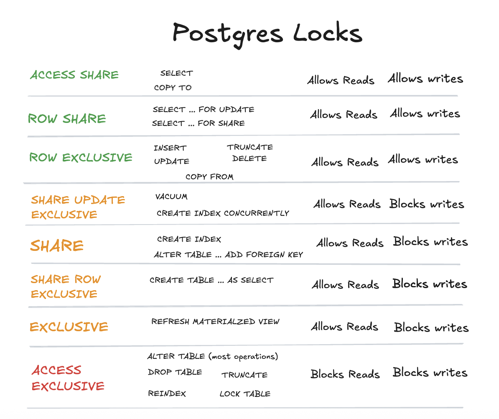
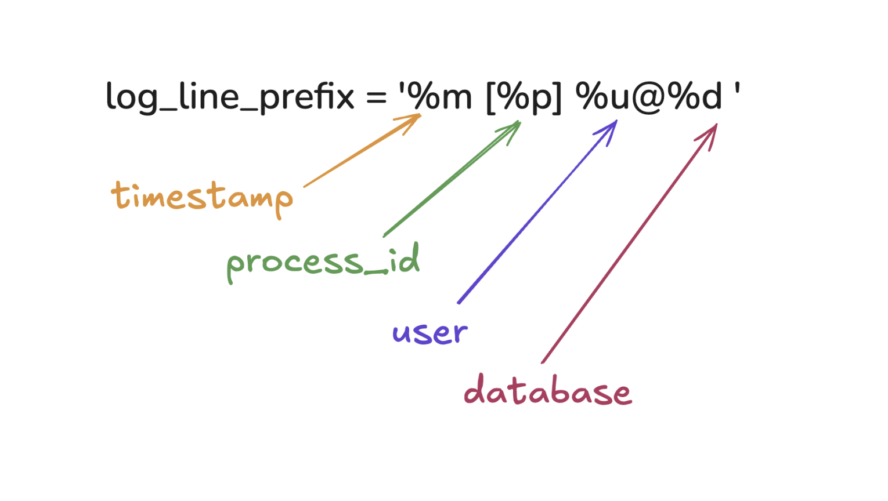

autoscale: true

[.background-color: #336791]
[.footer: Slide 1 / 52]

## Postgres Troubleshooting
<br>
<br>
### Hour 4 of PostgreSQL Training Day
### SCaLE LA 2026

---

[.background-color: #336791]
[.footer: Slide 2 / 52]

## Hour 4 Topics

[.column]

- Postgres internal catalog tables
- Logging configuration
- Finding and killing problem queries
- Statement timeout
- Monitoring essentials
- Getting help from the community

[.column]

**Training Materials**

**github.com/Snowflake-Labs/postgres-full-day-training**


---

[.background-color: #2F4F4F]
[.footer: Slide 3 / 52]

## Postgres Internal Catalogs

---

[.background-color: #2F4F4F]
[.footer: Slide 4 / 52]

## The System Catalog

PostgreSQL stores everything as tables - even metadata

- `pg_catalog` schema contains system tables
- `information_schema` provides SQL-standard views
- `pg_stat_*` views provide runtime statistics

---

[.background-color: #2F4F4F]
[.footer: Slide 5 / 52]

## Essential System Catalogs

| Catalog | Description |
|---------|-------------|
| `pg_database` | All databases |
| `pg_class` | Tables, indexes, sequences |
| `pg_attribute` | Columns |
| `pg_index` | Index information |
| `pg_proc` | Functions |
| `pg_roles` | Users and roles |

---

[.background-color: #2F4F4F]
[.footer: Slide 6 / 52]

## Exploring pg_class

```sql
SELECT relname, relkind, reltuples::bigint as row_estimate
FROM pg_class
WHERE relnamespace = 'bluebox'::regnamespace
  AND relkind = 'r' ORDER BY reltuples DESC LIMIT 5;
```

```
  relname  | relkind | row_estimate 
-----------+---------+--------------
 inventory | r       |      1463069
 rental    | r       |      1423080
 payment   | r       |      1422734
 film_crew | r       |       376111
 person    | r       |       258772
```

`relkind`: r=table, i=index, v=view, S=sequence

---

[.background-color: #2F4F4F]
[.footer: Slide 7 / 52]

## pg_stat_activity - Active Sessions

```sql
SELECT 
    pid,
    usename,
    application_name,
    client_addr,
    state,
    query_start,
    NOW() - query_start as query_duration,
    LEFT(query, 50) as query_preview
FROM pg_stat_activity
WHERE datname = 'bluebox'
  AND state != 'idle';
```

---

[.background-color: #2F4F4F]
[.footer: Slide 8 / 52]

## pg_stat_user_tables

```sql
SELECT relname, n_live_tup, n_dead_tup, last_autovacuum
FROM pg_stat_user_tables
WHERE schemaname = 'bluebox' ORDER BY n_live_tup DESC LIMIT 5;
```

```
  relname  | n_live_tup | n_dead_tup |      last_autovacuum       
-----------+------------+------------+----------------------------
 inventory |    1463069 |          0 | 2026-02-25 09:42:16
 rental    |    1423080 |          0 | 2026-02-25 09:42:17
 payment   |    1422734 |          0 | 2026-02-25 09:41:17
 film_crew |     376111 |          0 | 2026-02-25 09:41:18
 person    |     258772 |          0 | 2026-02-25 09:41:18
```

`n_dead_tup = 0` means autovacuum is doing its job!

---

[.background-color: #2F4F4F]
[.footer: Slide 9 / 52]

## pg_stat_user_indexes

```sql
SELECT relname, indexrelname, idx_scan,
       pg_size_pretty(pg_relation_size(indexrelid)) as size
FROM pg_stat_user_indexes
WHERE schemaname = 'bluebox' ORDER BY idx_scan DESC LIMIT 5;
```

```
     relname      |     indexrelname      | idx_scan |  size   
------------------+-----------------------+----------+---------
 customer         | customer_pkey         |  3036900 | 5936 kB
 film             | film_pkey             |  2080942 | 296 kB
 store            | store_pkey            |  1649809 | 16 kB
 inventory_status | inventory_status_pkey |  1463069 | 16 kB
 inventory        | inventory_pk          |  1423080 | 44 MB
```

Find unused indexes with `WHERE idx_scan = 0` 
  or `WHERE last_idx_scan < now()-'60 days'::interval`

---

[.background-color: #2F4F4F]
[.footer: Slide 10 / 52]

## pg_locks - Lock Information

```sql
SELECT 
    l.pid,
    l.locktype,
    l.mode,
    l.granted,
    a.usename,
    a.query
FROM pg_locks l
JOIN pg_stat_activity a ON l.pid = a.pid
WHERE NOT l.granted;  -- Waiting locks
```

---

[.background-color: #2F4F4F]
[.footer: Slide 11 / 52]



---

[.background-color: #2F4F4F]
[.footer: Slide 12 / 52]

## Find the Source of a Lock

```sql
WITH sos AS (
  SELECT array_cat(array_agg(pid),
    array_agg((pg_blocking_pids(pid))[array_length(pg_blocking_pids(pid),1)])) pids
  FROM pg_locks WHERE NOT granted
)
SELECT a.pid, a.usename, a.state,
   a.wait_event_type || ': ' || a.wait_event AS wait_event,
   current_timestamp-a.state_change time_in_state,
   l.relation::regclass relname, l.locktype, l.mode,
   pg_blocking_pids(l.pid) blocking_pids,
   (pg_blocking_pids(l.pid))[array_length(pg_blocking_pids(l.pid),1)] last_session,
   coalesce((pg_blocking_pids(l.pid))[1]||'.'||coalesce(
     case when locktype='transactionid' then 1 
     else array_length(pg_blocking_pids(l.pid),1)+1 end,0),
     a.pid||'.0') lock_depth,
   a.query
FROM pg_stat_activity a
JOIN sos s ON (a.pid = any(s.pids))
LEFT OUTER JOIN pg_locks l ON (a.pid = l.pid and not l.granted)
ORDER BY lock_depth;
```

---

[.background-color: #8B4513]
[.footer: Slide 13 / 52]

## Logging

---

[.background-color: #8B4513]
[.footer: Slide 14 / 52]

## Why Logging Matters

- Debugging application issues
- Security auditing
- Performance analysis
- Compliance requirements
- Troubleshooting production problems

Logs are like insurance - you may not need them every day, but when you have a problem, you're glad they're there.

---

[.background-color: #8B4513]
[.footer: Slide 15 / 52]

## Check Current Settings

```sql
-- See what's currently configured
SHOW logging_collector;   -- off by default!
SHOW log_destination;
SHOW log_statement;
SHOW log_min_duration_statement;
```

Logging collector is **off** by default - logs go to stderr (Docker captures this).

Let's enable file-based logging!

---

[.background-color: #8B4513]
[.footer: Slide 16 / 52]

## Enable Logging Collector

```sql
-- Enable the logging collector (writes to files)
ALTER SYSTEM SET logging_collector = 'on';

-- Configure where logs go (inside container)
ALTER SYSTEM SET log_directory = '/var/log/postgresql';
ALTER SYSTEM SET log_filename = 'postgresql.log';
```

⚠️ `logging_collector` requires a **restart** to take effect!

---

[.background-color: #8B4513]
[.footer: Slide 17 / 52]

## Restart Container

Restart the container to enable the logging collector:

```bash
docker compose down
docker compose --profile dba up -d
```

This restarts PostgreSQL with logging enabled, writing to `logs/postgresql.log`.

---

[.background-color: #8B4513]
[.footer: Slide 18 / 52]

## Start Tailing Logs

Open a **second terminal** and tail the log:

```bash
cd ~/Documents/GitHub/postgres-full-day-training
tail -f logs/postgresql.log
```

Keep this running! You'll see log entries appear in real-time as we make changes.

---

[.background-color: #8B4513]
[.footer: Slide 19 / 52]

## Log Severity Levels

Control what gets logged with `log_min_messages`:

| Level | Description |
|-------|-------------|
| PANIC | System must shut down |
| FATAL | Session terminates |
| ERROR | Operation aborts (not session) |
| WARNING | Potential problems |
| NOTICE | Non-critical issues |
| INFO | Informational messages |

```sql
-- Default is WARNING - show current setting
SHOW log_min_messages;
```

---

[.background-color: #8B4513]
[.footer: Slide 20 / 52]

## Log SQL Statements

`log_statement` controls which SQL statements are logged:

| Value | What's Logged |
|-------|---------------|
| none | Nothing (errors still logged) |
| ddl | CREATE, ALTER, DROP only |
| mod | DDL + INSERT/UPDATE/DELETE |
| all | Every statement (verbose!) |

```sql
-- Turn on ALL statement logging temporarily
ALTER SYSTEM SET log_statement = 'all';
SELECT pg_reload_conf();

-- Now run a query and watch your tail window!
SELECT title FROM bluebox.film LIMIT 3;
```

---

[.background-color: #8B4513]
[.footer: Slide 21 / 52]

## See It in the Log

Your tail window should show:

```
2026-01-30 12:34:56.789 CST [1234] postgres@bluebox 
  LOG:  statement: SELECT title FROM bluebox.film LIMIT 3;
```

```sql
-- Put it back to DDL only (recommended for production)
ALTER SYSTEM SET log_statement = 'ddl';
SELECT pg_reload_conf();
```

---

[.background-color: #8B4513]
[.footer: Slide 22 / 52]

## Log DDL Changes

With `log_statement = 'ddl'`, only schema changes are logged:

```sql
-- This WILL be logged
CREATE TABLE bluebox.log_test (id serial, name text);

-- This will NOT be logged (not DDL)
INSERT INTO bluebox.log_test (name) VALUES ('test');

-- This WILL be logged
DROP TABLE bluebox.log_test;
```

Check your tail window - only CREATE and DROP appear!

---

[.background-color: #8B4513]
[.footer: Slide 23 / 52]

## Log Slow Queries

`log_min_duration_statement` logs queries that exceed a time threshold.

- Set to `-1` to disable (default)
- Set to `0` to log all queries with their duration
- Set to `100ms`, `1s`, etc. to log only slow queries

```sql
-- Check current slow query threshold
SHOW log_min_duration_statement;

-- Lower it to catch queries > 100ms
ALTER SYSTEM SET log_min_duration_statement = '100ms';
SELECT pg_reload_conf();

-- This slow query will be logged with its duration
SELECT pg_sleep(0.2);
```

---

[.background-color: #8B4513]
[.footer: Slide 24 / 52]

## Log SQL Errors

`log_min_error_statement` logs the SQL that caused an error.

Without this, you see the error message but not what query caused it!

```sql
-- Enable logging the statement that caused errors
ALTER SYSTEM SET log_min_error_statement = 'error';
SELECT pg_reload_conf();

-- Now cause an error
SELECT * FROM bluebox.nonexistent_table;
```

Log output shows both error AND the offending statement:

```
ERROR:  relation "bluebox.nonexistent_table" does not exist
STATEMENT:  SELECT * FROM bluebox.nonexistent_table;
```

---

[.background-color: #8B4513]
[.footer: Slide 25 / 52]

## Log Line Prefix

[.column]

`log_line_prefix` controls metadata at the start of each log line:

| Escape | Meaning |
|--------|---------|
| %m | Timestamp with ms |
| %p | Process ID |
| %u | User name |
| %d | Database |
| %a | Application name |
| %h | Client IP (new in v18!) |

```sql
ALTER SYSTEM SET log_line_prefix = '%m [%p] %h %u@%d ';
SELECT pg_reload_conf();
```

[.column]



---

[.background-color: #8B4513]
[.footer: Slide 26 / 52]

## Log Lock Waits

`log_lock_waits` logs when queries wait for locks longer than `deadlock_timeout` (default 1s).

```sql
-- Enable lock wait logging
ALTER SYSTEM SET log_lock_waits = 'on';
SELECT pg_reload_conf();
```

---

[.background-color: #8B4513]
[.footer: Slide 27 / 52]

## Simulate a Lock Wait

**Terminal 1** - Start a transaction and hold a lock:

```sql
BEGIN;
UPDATE bluebox.film SET vote_average = vote_average 
WHERE film_id = 11;
-- Don't commit! Leave this open...
```

**Terminal 2** - Try to update the same row (this will wait):

```sql
UPDATE bluebox.film SET vote_average = vote_average 
WHERE film_id = 11;
```

Wait 1+ seconds, then check your log tail! Then `COMMIT;` in Terminal 1.

---

[.background-color: #8B4513]
[.footer: Slide 28 / 52]

## pgAudit: Detailed Audit Logging

For compliance requirements (SOC2, HIPAA, etc.):

```sql
-- Add to shared_preload_libraries, then:
CREATE EXTENSION pgaudit;

-- What to audit
ALTER SYSTEM SET pgaudit.log = 'ddl, write';
SELECT pg_reload_conf();
```

---

[.background-color: #8B4513]
[.footer: Slide 29 / 52]

## pgAudit: Example Output

Run a DDL command:

```sql
CREATE TABLE bluebox.audit_test (id int);
DROP TABLE bluebox.audit_test;
```

Check your log - pgAudit adds structured detail:

```
AUDIT: SESSION,1,1,DDL,CREATE TABLE,TABLE,bluebox.audit_test,
  "CREATE TABLE bluebox.audit_test (id int);",<not logged>
AUDIT: SESSION,2,1,DDL,DROP TABLE,TABLE,bluebox.audit_test,
  "DROP TABLE bluebox.audit_test;",<not logged>
```

Shows: audit type, statement ID, object type, object name, full SQL.

---

[.background-color: #006400]
[.footer: Slide 30 / 52]

## Finding and Killing Problems

---

[.background-color: #006400]
[.footer: Slide 31 / 52]

## Common Problems

- Long-running queries blocking others
- Idle transactions holding locks
- Runaway queries consuming resources
- Connection exhaustion
- Lock contention

---

[.background-color: #006400]
[.footer: Slide 32 / 52]

## Finding Long-Running Queries

```sql
SELECT 
    pid,
    NOW() - query_start as duration,
    usename,
    state,
    query
FROM pg_stat_activity
WHERE state != 'idle'
ORDER BY query_start
LIMIT 10;
```

---

[.background-color: #006400]
[.footer: Slide 33 / 52]

## Finding Idle Transactions

```sql
-- Idle transactions can hold locks!
SELECT 
    pid,
    NOW() - xact_start as transaction_duration,
    NOW() - state_change as idle_duration,
    usename,
    query
FROM pg_stat_activity
WHERE state = 'idle in transaction'
  AND xact_start IS NOT NULL
ORDER BY xact_start;
```

---

[.background-color: #006400]
[.footer: Slide 34 / 52]

## Finding Blocked Queries

```sql
SELECT 
    blocked.pid AS blocked_pid,
    blocked.query AS blocked_query,
    blocking.pid AS blocking_pid,
    blocking.query AS blocking_query
FROM pg_stat_activity blocked
JOIN pg_locks blocked_locks ON blocked.pid = blocked_locks.pid
JOIN pg_locks blocking_locks ON blocked_locks.locktype = blocking_locks.locktype
    AND blocked_locks.relation = blocking_locks.relation
    AND blocked_locks.pid != blocking_locks.pid
JOIN pg_stat_activity blocking ON blocking_locks.pid = blocking.pid
WHERE NOT blocked_locks.granted;
```

---

[.background-color: #006400]
[.footer: Slide 35 / 52]

## Canceling a Query

```sql
-- Cancel the current query (graceful)
SELECT pg_cancel_backend(12345);

-- Returns true if signal sent successfully
```

The query receives an interrupt and can clean up

---

[.background-color: #006400]
[.footer: Slide 36 / 52]

## Terminating a Connection

```sql
-- Terminate the entire connection (forceful)
SELECT pg_terminate_backend(12345);

-- Terminate all connections to a database except our own
SELECT pg_terminate_backend(pid)
FROM pg_stat_activity
WHERE datname = 'bluebox'
  AND pid != pg_backend_pid();
```

---

[.background-color: #006400]
[.footer: Slide 37 / 52]

## Statement Timeout

Automatically kill queries that run too long

```sql
-- Set for session
SET statement_timeout = '30s';

-- Set for a single transaction
BEGIN;
SET LOCAL statement_timeout = '10s';
SELECT * FROM huge_table;  -- Will timeout after 10s
COMMIT;

-- Set per user
ALTER ROLE app_user SET statement_timeout = '60s';
```

---

[.background-color: #006400]
[.footer: Slide 38 / 52]

## Idle Transaction Timeout

Kill sessions that sit idle in a transaction

```sql
-- postgresql.conf or per-session
idle_in_transaction_session_timeout = '10min'

-- Per user
ALTER ROLE app_user SET idle_in_transaction_session_timeout = '5min';
```

---

[.background-color: #006400]
[.footer: Slide 39 / 52]

## Lock Timeout

Don't wait forever for locks

```sql
-- Set lock timeout
SET lock_timeout = '5s';

-- Now this will fail fast if table is locked
ALTER TABLE bluebox.rental ADD COLUMN new_col INT;

-- ERROR: canceling statement due to lock timeout
```

---

[.background-color: #191970]
[.footer: Slide 40 / 52]

## Monitor Postgres

- Catch problems before users notice
- Capacity planning
- Performance baselines
- Audit trails
- Sleep better at night

---

[.background-color: #191970]
[.footer: Slide 41 / 52]

## What to Monitor

[.column]

### System Level
- CPU usage
- Memory usage
- Disk I/O
- Network
- Disk space

[.column]

### Postgres Level
- Connections
- Transaction rate
- Cache hit ratio
- Replication lag
- Locks

---

[.background-color: #191970]
[.footer: Slide 42 / 52]

## Key Metrics to Watch

```sql
-- Connection count
SELECT count(*) FROM pg_stat_activity;

-- Database size growth
SELECT pg_database_size('bluebox');

-- Transaction rate (per second)
SELECT (xact_commit + xact_rollback) / extract(epoch from now() -  coalesce(stats_reset, 
(pg_catalog.pg_stat_file('base/' || datid || '/PG_VERSION')).modification)) AS tps
FROM pg_stat_database 
WHERE datname = 'bluebox';
```

---

[.background-color: #191970]
[.footer: Slide 43 / 52]

## Cache Hit Ratio

```sql
SELECT 
    datname,
    ROUND(
        blks_hit::numeric / NULLIF(blks_hit + blks_read, 0) * 100, 
        2
    ) as cache_hit_ratio
FROM pg_stat_database
WHERE datname = 'bluebox';

-- Should be > 99% for OLTP workloads
```

---

[.background-color: #191970]
[.footer: Slide 44 / 52]

## Monitoring Tools

| Open Source | Commercial |
|-------------|------------|
| pg_stat_monitor | pganalyze |
| Prometheus + postgres_exporter | Datadog |
| Grafana | New Relic |
| pgwatch2 | Sentry |
| pgmonitor ||

---

[.background-color: #191970]
[.footer: Slide 45 / 52]

## Simple Health Check Query

```sql
SELECT 
    'connections' as metric, 
    count(*)::text as value 
FROM pg_stat_activity
UNION ALL
SELECT 
    'database_size', 
    pg_size_pretty(pg_database_size('bluebox'))
UNION ALL
SELECT 
    'active_queries', 
    count(*)::text 
FROM pg_stat_activity 
WHERE state = 'active'
UNION ALL
SELECT 
    'oldest_transaction', 
    COALESCE(max(age(backend_xmin))::text, 'none')
FROM pg_stat_activity;
```

---

[.background-color: #800020]
[.footer: Slide 46 / 52]

## Getting Help from the Community

---

[.background-color: #800020]
[.footer: Slide 47 / 52]

## PostgreSQL Community Resources

- **Documentation** - postgresql.org/docs
- **Mailing Lists** - pgsql-general, pgsql-performance
- **IRC** - #postgresql on Libera.Chat
- **Slack** - http://pgtreats.info/slack-invite
- **Reddit** - r/PostgreSQL

---

[.background-color: #800020]
[.footer: Slide 48 / 52]

## Before Asking for Help

Gather this information:

1. PostgreSQL version (`SELECT version();`)
2. Operating system / host
3. Exact error message
4. Relevant configuration settings
5. Steps to reproduce
6. What you've already tried

---

[.background-color: #800020]
[.footer: Slide 49 / 52]

## Good Question Example

> **PostgreSQL 17.1 on Ubuntu 24.04**
>
> I'm getting "could not extend file" errors during INSERT:
>
> `ERROR: could not extend file "base/16384/24576": No space left on device`
>
> Disk shows 50GB free. Tablespace is on /data.
> 
> I've checked: pg_tblspc links, df output, du on data directory.

---

[.background-color: #800020]
[.footer: Slide 50 / 52]

## Other Resources

- **Planet PostgreSQL** - blogs.postgresql.org
- **Cooper Press Postgres Weekly** - weekly newsletter
- **PostgreSQL Wiki** - wiki.postgresql.org
- **Postgres events** - [Meet the community in person](https://www.postgresql.org/about/events/)
- **Local user groups** - [Regional and online PUGs](https://www.meetup.com/pro/postgresql/)

---

[.background-color: #336791]
[.footer: Slide 51 / 52]

## Hour 4 Summary

- ✅ System catalogs for metadata queries
- ✅ Logging: severity levels, slow queries, locks
- ✅ Finding long-running queries and locks
- ✅ pg_cancel_backend vs pg_terminate_backend
- ✅ Timeout settings as guardrails
- ✅ Key metrics: connections, cache ratio, transactions
- ✅ Community resources for help

---

[.background-color: #336791]
[.footer: Slide 52 / 52]

## Questions?

<br>
<br>

## Next: Postgres Configuration and Performance Tuning

^ Slide 52 / 52
