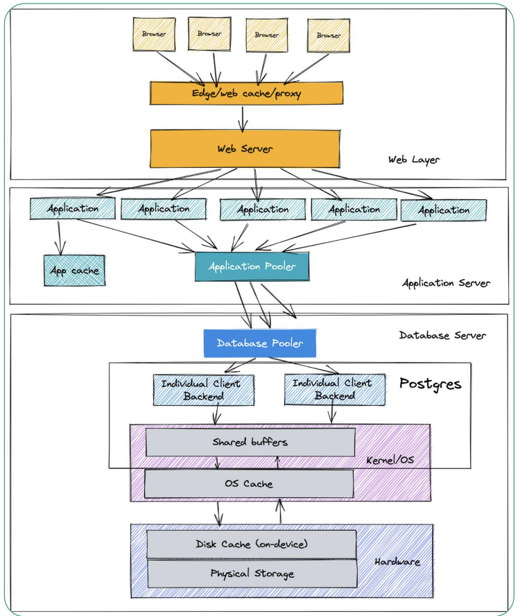
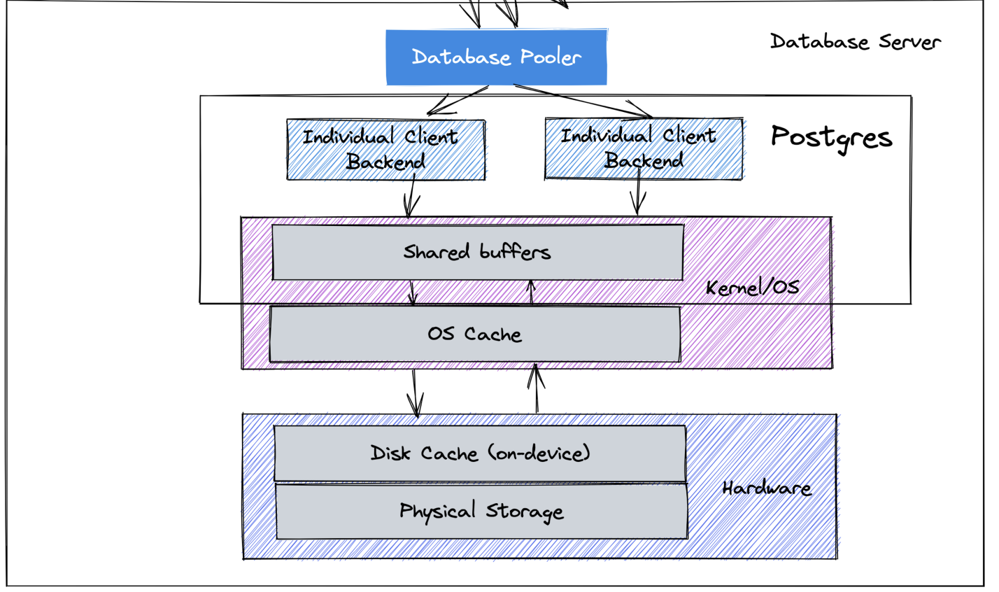
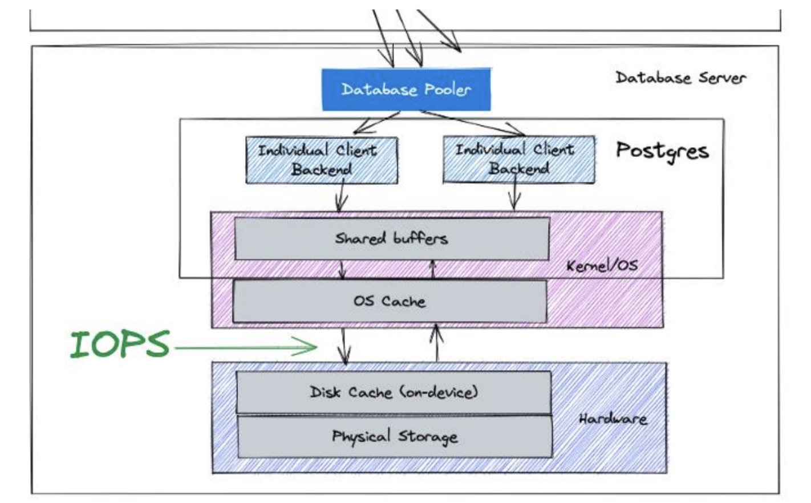
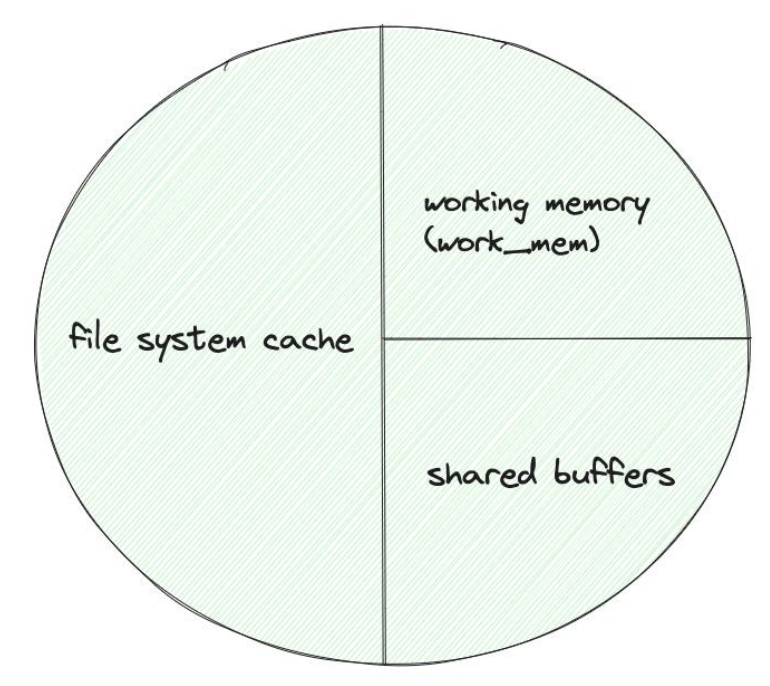
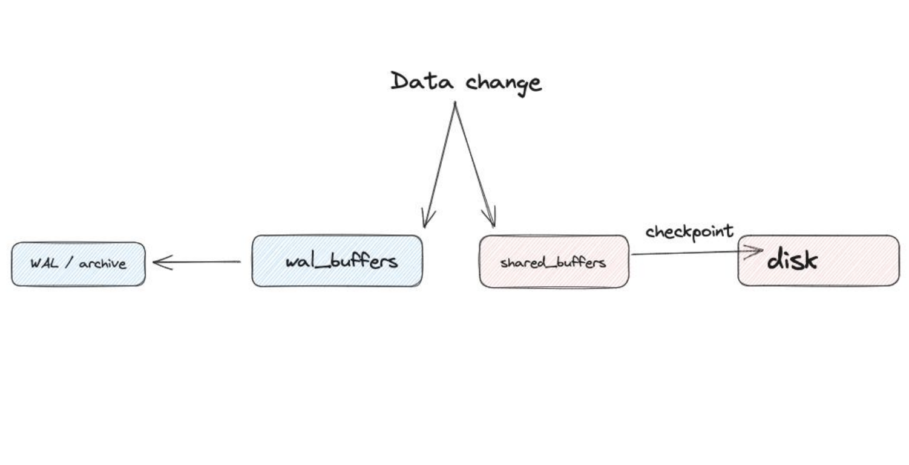
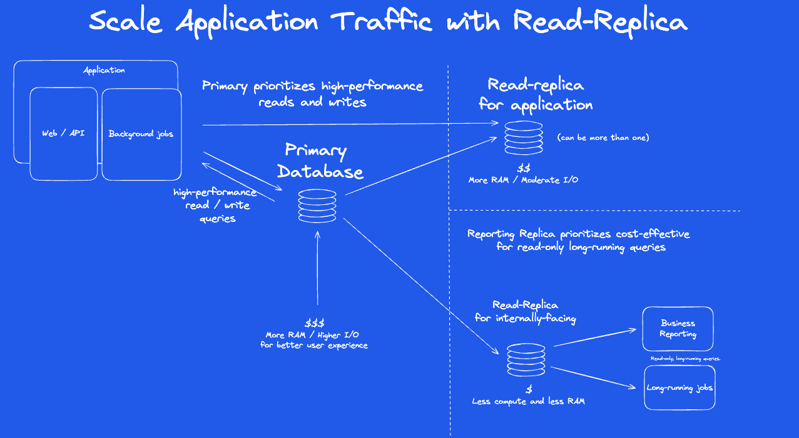
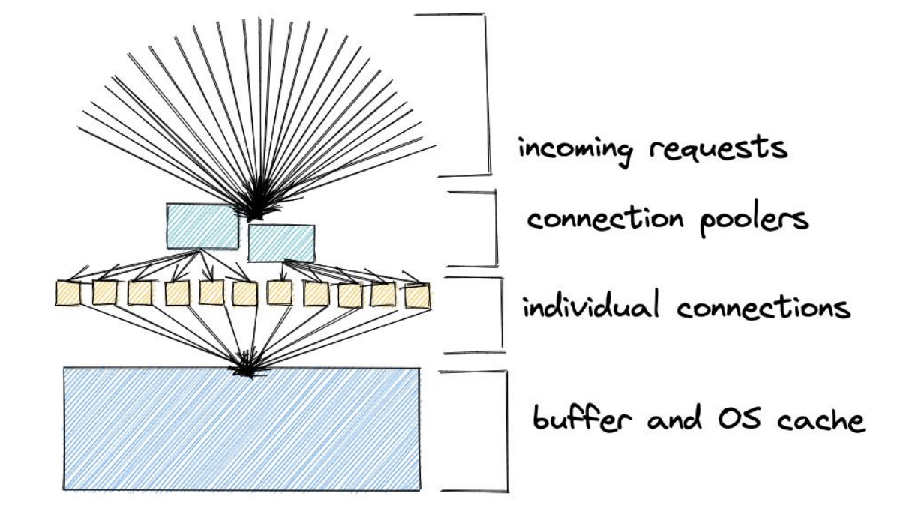

autoscale: true

[.background-color: #336791]
[.footer: Slide 1 / 52]

## Postgres Configuration and Performance Tuning
<br>
<br>
### Hour 5 of PostgreSQL Training Day
### SCaLE LA 2026

---

[.background-color: #336791]
[.footer: Slide 2 / 52]

## Hour 5 Topics

[.column]

- Postgres architecture
- Memory configuration
- Cache hit ratio
- Shared buffers / Work memory
- I/O tuning
- Parallel query execution
- Vacuum and autovacuum

[.column]

**Training Materials**

**github.com/Snowflake-Labs/postgres-full-day-training**


---

[.background-color: #2F4F4F]
[.footer: Slide 3 / 52]

## Postgres Architecture

---

[.background-color: #2F4F4F]
[.footer: Slide 4 / 52]



---

[.background-color: #2F4F4F]
[.footer: Slide 5 / 52]

#### Memory Architecture



---

[.background-color: #2F4F4F]
[.footer: Slide 6 / 52]

## i/o



---

[.background-color: #2F4F4F]
[.footer: Slide 7 / 52]

## Background Processes

| Process | Function |
|---------|----------|
| Background Writer | Writes dirty pages to disk |
| WAL Writer | Flushes WAL to disk |
| Checkpointer | Periodic full sync |
| Autovacuum | Cleans dead rows |
| Stats Collector | Gathers statistics |
| Archiver | Archives WAL files |

---

[.background-color: #8B4513]
[.footer: Slide 8 / 52]

## Memory Configuration



---

[.background-color: #8B4513]
[.footer: Slide 9 / 52]

## Shared Buffers

The database page cache - most important setting

```sql
-- Check current value
SHOW shared_buffers;

-- Set in postgresql.conf
shared_buffers = 8GB   -- For 32GB RAM system

-- Requires restart to change
```

**Rule of thumb**: Start with 25% of available RAM

---

[.background-color: #8B4513]
[.footer: Slide 10 / 52]

## Shared Buffers Guidelines

| System RAM | shared_buffers |
|------------|----------------|
| 4GB | 1GB |
| 16GB | 4GB |
| 64GB | 16GB |
| 256GB | 32-64GB |

Beyond 32GB, diminishing returns - OS cache helps too

---

[.background-color: #8B4513]
[.footer: Slide 11 / 52]

## Effective Cache Size

Tells the planner how much memory is available for caching

```sql
-- Set higher = planner prefers index scans
-- Set lower = planner prefers sequential scans

effective_cache_size = 24GB  -- For 32GB system
```

This is just a hint - doesn't allocate memory

---

[.background-color: #8B4513]
[.footer: Slide 12 / 52]

## Cache Hit Ratio

```sql
SELECT datname, blks_hit, blks_read,
    ROUND(100.0 * blks_hit / 
          NULLIF(blks_hit + blks_read, 0), 2) as hit_ratio
FROM pg_stat_database WHERE datname = 'bluebox';
```

```
 datname | blks_hit  | blks_read | hit_ratio 
---------+-----------+-----------+-----------
 bluebox | 109171275 |    301352 |     99.72
```

Target: **> 99%** for OLTP workloads ✓

---

[.background-color: #8B4513]
[.footer: Slide 13 / 52]

## What's in the Buffer Cache?

```sql
-- Install pg_buffercache extension
CREATE EXTENSION pg_buffercache;

-- See what's cached
SELECT 
    c.relname,
    count(*) as buffers,
    pg_size_pretty(count(*) * 8192) as size
FROM pg_buffercache b
JOIN pg_class c ON b.relfilenode = c.relfilenode
WHERE b.reldatabase = (SELECT oid FROM pg_database WHERE datname = current_database())
GROUP BY c.relname
ORDER BY count(*) DESC
LIMIT 10;
```

---

[.background-color: #006400]
[.footer: Slide 14 / 52]

## Work Memory

---

[.background-color: #006400]
[.footer: Slide 15 / 52]

## What is work_mem?

Memory for query operations:

- Sorting (ORDER BY)
- Hash joins
- Hash aggregations
- Window functions

```sql
SHOW work_mem;  -- Default: 4MB
```

---

[.background-color: #006400]
[.footer: Slide 16 / 52]

## work_mem Behavior

Each operation can use up to work_mem

```sql
-- This query might use 4 x work_mem
SELECT f.title, p.name, COUNT(*) as appearances
FROM film f
JOIN film_cast fc ON f.film_id = fc.film_id  -- hash join
JOIN person p ON fc.person_id = p.person_id  -- hash join
GROUP BY f.title, p.name                      -- hash aggregate
ORDER BY appearances DESC;                    -- sort
```

---

[.background-color: #006400]
[.footer: Slide 17 / 52]

## Setting work_mem

**Be careful**: work_mem × connections × operations

```sql
-- Global setting (conservative)
work_mem = 64MB

-- Increase for specific session
SET work_mem = '256MB';
-- Run complex analytical query
RESET work_mem;
```

---

[.background-color: #006400]
[.footer: Slide 18 / 52]

## When to Increase work_mem

Signs you need more:

```sql
-- Check for disk sorts
EXPLAIN (ANALYZE, BUFFERS) SELECT ...

-- Look for:
-- Sort Method: external merge  ← disk sort, increase work_mem
-- Sort Method: quicksort      ← memory sort, good!
```

---

[.background-color: #006400]
[.footer: Slide 19 / 52]

## Maintenance Work Memory

Used by maintenance operations:

```sql
maintenance_work_mem = 1GB

-- Affects:
-- VACUUM
-- CREATE INDEX
-- ALTER TABLE ADD FOREIGN KEY
```

Can be set much higher than work_mem

---

[.background-color: #191970]
[.footer: Slide 20 / 52]

## Checkpoints

[.column]

```sql
-- How often (in WAL segments or time)
checkpoint_timeout = 15min
max_wal_size = 4GB

-- How fast (spread I/O over time)
checkpoint_completion_target = 0.9
```

[.column]



---

[.background-color: #191970]
[.footer: Slide 21 / 52]

## Checkpoint Tuning

```
More frequent checkpoints:
  + Faster crash recovery
  - More I/O overhead
  - More WAL written

Less frequent checkpoints:
  + Less I/O
  + Better performance
  - Slower crash recovery
  - Need more disk space for WAL
```

---

[.background-color: #191970]
[.footer: Slide 22 / 52]

## Sequential vs Random I/O Costs

```sql
-- Tells planner relative costs
seq_page_cost = 1.0      -- Sequential read cost
random_page_cost = 4.0   -- Random read cost (default)

-- For SSDs, reduce random_page_cost
random_page_cost = 1.1   -- SSDs have nearly equal random/sequential
```

---

[.background-color: #191970]
[.footer: Slide 23 / 52]

## Parallel Query Execution

Postgres can use multiple CPU cores for a single query:

- Sequential scans
- Hash joins
- Aggregations
- Index scans (Postgres 17+)

---

[.background-color: #191970]
[.footer: Slide 24 / 52]

## Parallel Query Defaults

```sql
-- Check current settings
SHOW max_parallel_workers_per_gather;  -- Default: 2
SHOW max_parallel_workers;             -- Default: 8
SHOW max_worker_processes;             -- Default: 8
SHOW parallel_tuple_cost;              -- Default: 0.1
SHOW min_parallel_table_scan_size;     -- Default: 8MB
```

Parallel kicks in for larger tables automatically.

---

[.background-color: #191970]
[.footer: Slide 25 / 52]

## Increasing Parallel Workers

```sql
-- Allow more workers per query (requires restart for max_worker_processes)
ALTER SYSTEM SET max_worker_processes = 16;
ALTER SYSTEM SET max_parallel_workers = 12;

-- More workers per query operation
ALTER SYSTEM SET max_parallel_workers_per_gather = 4;

-- Apply changes
SELECT pg_reload_conf();
```

**Rule of thumb**: `max_parallel_workers_per_gather` = CPU cores / 4

---

[.background-color: #191970]
[.footer: Slide 26 / 52]

## Parallel Query in EXPLAIN

```sql
EXPLAIN ANALYZE SELECT count(*) FROM bluebox.film;
```

```
Finalize Aggregate
  ->  Gather
        Workers Planned: 2
        Workers Launched: 2
        ->  Partial Aggregate
              ->  Parallel Seq Scan on film
```

"Workers Launched: 2" means parallel execution worked!

---

[.background-color: #8B4513]
[.footer: Slide 27 / 52]

## Memory Settings Summary

| Setting | Purpose | Typical Value |
|---------|---------|---------------|
| `shared_buffers` | Database cache | 25% of RAM |
| `effective_cache_size` | Planner hint | 50-75% of RAM |
| `work_mem` | Sort/hash memory | 16-256MB |
| `maintenance_work_mem` | VACUUM, CREATE INDEX | 512MB-2GB |

---

[.background-color: #4B0082]
[.footer: Slide 28 / 52]

## Vacuum and Autovacuum

---

[.background-color: #4B0082]
[.footer: Slide 29 / 52]

## Why Does Postgres Need Vacuum?

Postgres uses **MVCC** (Multi-Version Concurrency Control):

- UPDATE/DELETE doesn't erase rows immediately
- Old versions are marked as "dead tuples"
- Dead tuples = **bloat**

Vacuum reclaims this space for reuse.

---

[.background-color: #4B0082]
[.footer: Slide 30 / 52]

## Autovacuum: The Robot Cleaner

Autovacuum has been on by default since Postgres 8.3 (2008).

It triggers when:

```
Dead Tuples > (Threshold + Scale Factor × Total Tuples)
```

Default: **50 rows + 20% of table size**

For a 1,000 row table → vacuum at ~250 dead rows

---

[.background-color: #4B0082]
[.footer: Slide 31 / 52]

## Do You Need to Tune Autovacuum?

**Usually no!** Defaults work for most workloads. But lots of dead rows can affect performance.

Consider tuning if you see:

- High bloat (> 50% of table size)
- Unusually high disk usage vs actual data
- Slow queries + high bloat
- I/O contention from vacuum running

---

[.background-color: #4B0082]
[.footer: Slide 32 / 52]

## Check Dead Tuples Waiting for Cleanup

```sql
SELECT 
    relname AS table_name,
    n_dead_tup AS dead_rows,
    n_live_tup AS live_rows,
    last_autovacuum,
    last_vacuum
FROM pg_stat_user_tables
ORDER BY n_dead_tup DESC
LIMIT 10;
```

---

[.background-color: #4B0082]
[.footer: Slide 33 / 52]

## Tuning: Scale Factor

For large tables, 20% is too long to wait.

100M row table = waiting for 20M dead rows!

```sql
-- Vacuum more frequently (10% instead of 20%)
ALTER TABLE big_table 
SET (autovacuum_vacuum_scale_factor = 0.1);

-- Or use absolute threshold for huge tables
ALTER TABLE huge_table 
SET (autovacuum_vacuum_threshold = 1000000);
```

---

[.background-color: #4B0082]
[.footer: Slide 34 / 52]

## Tuning: Cost-Based Throttling

If vacuum is causing I/O pressure, slow it down:

```sql
-- Increase delay between vacuum operations (default 2ms)
ALTER TABLE busy_table 
SET (autovacuum_vacuum_cost_delay = '5ms');

-- Lower cost limit = more frequent pauses
ALTER TABLE busy_table 
SET (autovacuum_vacuum_cost_limit = 100);
```

---

[.background-color: #4B0082]
[.footer: Slide 35 / 52]

## Transaction ID Wraparound

Postgres uses 32-bit transaction IDs (~2 billion).

Vacuum "freezes" old rows so IDs can be reused.

If you hit wraparound → **database shuts down!**

```sql
-- Check oldest unfrozen transaction age
SELECT datname, age(datfrozenxid) 
FROM pg_database 
ORDER BY age DESC;
```

Stay well under 2 billion.

---

[.background-color: #4B0082]
[.footer: Slide 36 / 52]

## Vacuum Summary

| Setting | When to Tune |
|---------|--------------|
| `autovacuum_vacuum_scale_factor` | Large tables with high churn |
| `autovacuum_vacuum_cost_delay` | Vacuum causing I/O pressure |
| `autovacuum_freeze_max_age` | Anti-wraparound hitting peak hours |

**Rule of thumb**: Aim for vacuum every ~2M dead rows on big tables.

---

[.background-color: #800020]
[.footer: Slide 37 / 52]

## Scaling Reads and Writes

---

[.background-color: #800020]
[.footer: Slide 38 / 52]

## Scaling Strategies

[.column]

### Vertical Scaling
- More CPU
- More RAM
- Faster storage
- Limits exist

[.column]

### Horizontal Scaling
- Read replicas
- Connection pooling
- Partitioning
- Sharding

---

[.background-color: #800020]
[.footer: Slide 39 / 52]

## Read Scaling with Replicas



---

[.background-color: #800020]
[.footer: Slide 40 / 52]

## Connection Pooling



Reduces connection overhead dramatically

---

[.background-color: #800020]
[.footer: Slide 41 / 52]

## Table Partitioning

Break large tables into smaller pieces

```sql
-- Example: partitioning payment by date
CREATE TABLE bluebox.payment_partitioned (
    payment_id SERIAL,
    payment_date TIMESTAMPTZ NOT NULL,
    customer_id INT,
    amount NUMERIC(5,2)
) PARTITION BY RANGE (payment_date);

CREATE TABLE payment_2024 PARTITION OF bluebox.payment_partitioned
    FOR VALUES FROM ('2024-01-01') TO ('2025-01-01');

CREATE TABLE payment_2025 PARTITION OF bluebox.payment_partitioned
    FOR VALUES FROM ('2025-01-01') TO ('2026-01-01');
```

---

[.background-color: #800020]
[.footer: Slide 42 / 52]

## Partitioning Benefits

- Faster queries with partition pruning
- Easier data archival (DROP old partitions)
- Parallel query per partition
- Smaller indexes per partition
- Faster VACUUM per partition

---

[.background-color: #800020]
[.footer: Slide 43 / 52]

## Write Scaling Challenges

PostgreSQL is single-writer by design

Options:
- Optimize single node (better hardware)
- Application-level sharding
- Citus extension (distributed tables)
- Accept eventual consistency with logical replication

---

[.background-color: #CC5500]
[.footer: Slide 44 / 52]

## Configuration Management

---

[.background-color: #CC5500]
[.footer: Slide 45 / 52]

## Where Settings Live

```sql
-- Show config file locations
SHOW config_file;     -- Main: postgresql.conf
SHOW hba_file;        -- Access: pg_hba.conf
SHOW data_directory;  -- Data directory
```

---

[.background-color: #CC5500]
[.footer: Slide 46 / 52]

## Changing Settings

```sql
SELECT name, setting, unit, context
FROM pg_settings WHERE name IN 
('shared_buffers', 'work_mem', 'effective_cache_size');
```

```
         name         | setting  | unit | context    
----------------------+----------+------+------------
 shared_buffers       | 1048576  | 8kB  | postmaster
 work_mem             | 262144   | kB   | user
 effective_cache_size | 524288   | 8kB  | user
```

`postmaster` = restart, `user` = SET in session

---

[.background-color: #CC5500]
[.footer: Slide 47 / 52]

## Applying Changes

```sql
-- Reload configuration (no downtime)
SELECT pg_reload_conf();

-- Or from command line
pg_ctl reload -D /var/lib/postgresql/17/main

-- Check pending changes
SELECT name, setting, pending_restart
FROM pg_settings
WHERE pending_restart;
```

---

[.background-color: #CC5500]
[.footer: Slide 48 / 52]

## ALTER SYSTEM

```sql
-- Modify settings without editing file
ALTER SYSTEM SET work_mem = '128MB';

-- Written to postgresql.auto.conf
-- Takes effect after reload (or restart)
SELECT pg_reload_conf();

-- Reset to default
ALTER SYSTEM RESET work_mem;
```

---

[.background-color: #CC5500]
[.footer: Slide 49 / 52]

## Starting Point Configuration

```sql
-- For a dedicated 32GB database server:

shared_buffers = 8GB
effective_cache_size = 24GB
work_mem = 64MB
maintenance_work_mem = 2GB

max_connections = 200
max_wal_size = 4GB
checkpoint_timeout = 15min

random_page_cost = 1.1        -- SSD
effective_io_concurrency = 200 -- SSD
```

---

[.background-color: #CC5500]
[.footer: Slide 50 / 52]

## PGTune

Online tool for generating starting configurations

**pgtune.leopard.in.ua**

Input:
- PostgreSQL version
- OS type
- RAM
- CPU cores
- Storage type
- Workload type

---

[.background-color: #336791]
[.footer: Slide 51 / 52]

## Hour 5 Summary

- ✅ Postgres architecture and processes
- ✅ Memory: shared_buffers, work_mem
- ✅ Cache hit ratio monitoring
- ✅ I/O tuning: checkpoints, WAL
- ✅ Parallel query configuration
- ✅ Vacuum and autovacuum tuning
- ✅ Scaling: replicas, pooling, partitioning
- ✅ Configuration management best practices

---

[.background-color: #336791]
[.footer: Slide 52 / 52]

## Questions?

<br>
<br>

## Next: Postgres Query Tuning

^ Slide 52 / 52
