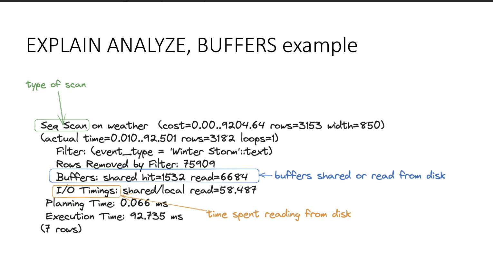
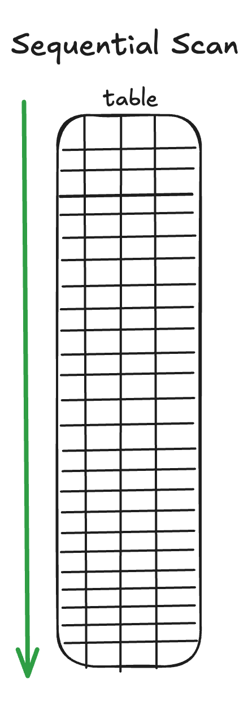
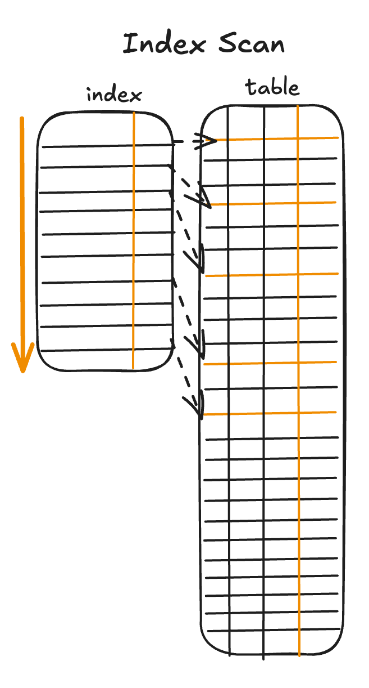
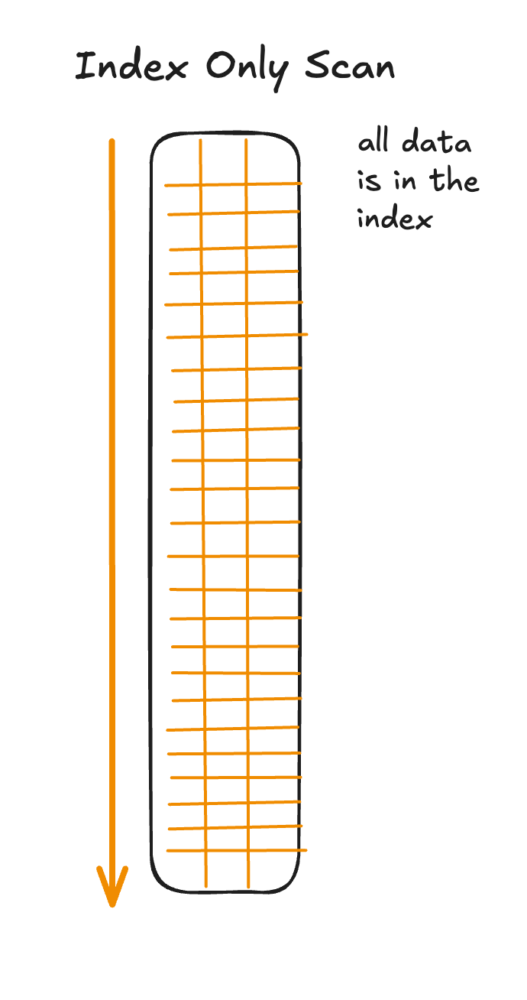
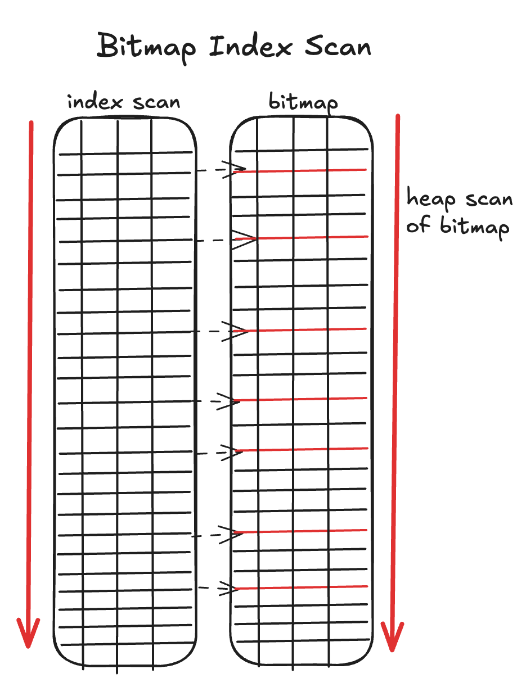
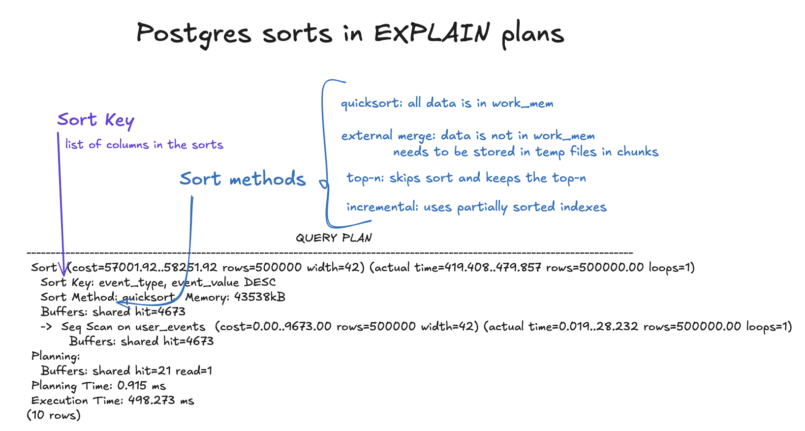
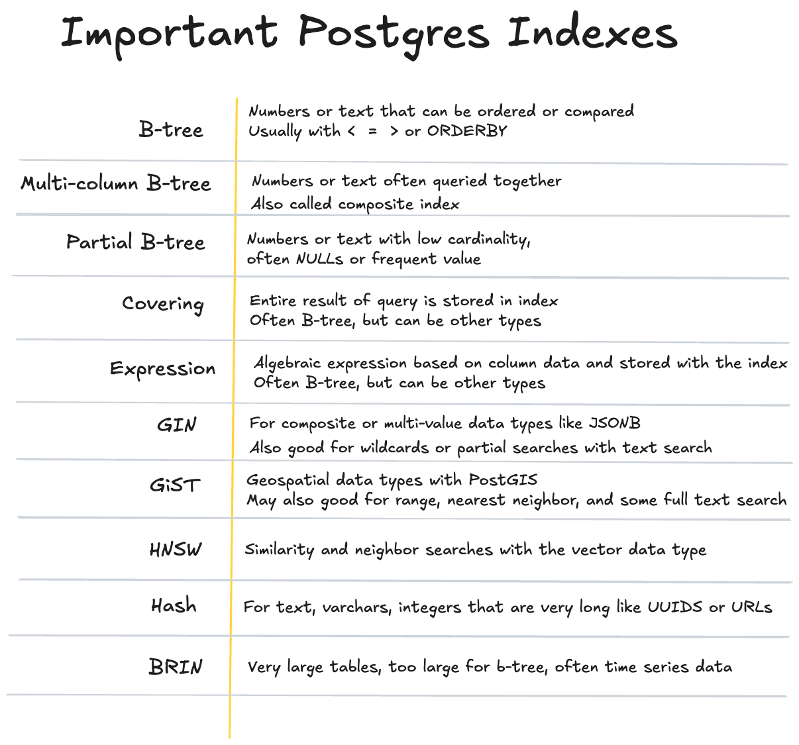

autoscale: true

[.background-color: #336791]
[.footer: Slide 1 / 63]

## Postgres Query Tuning
<br>
<br>
### Hour 6 of PostgreSQL Training Day
### SCaLE LA 2026

---

[.background-color: #336791]
[.footer: Slide 2 / 63]

## Hour 6 Topics

[.column]

- Understanding EXPLAIN
- Reading query plans
- pg_stat_statements
- auto_explain
- Index types and strategies
- Common performance patterns

[.column]

**Training Materials**

**github.com/elizabeth-christensen/postgres-full-day-training**


---

[.background-color: #2F4F4F]
[.footer: Slide 3 / 63]

## EXPLAIN - The Essential Tool

---

[.background-color: #2F4F4F]
[.footer: Slide 4 / 63]

## What is EXPLAIN?

Shows you the query execution plan

```sql
EXPLAIN SELECT * FROM bluebox.film WHERE vote_average > 8;
```

Output:

```
                        QUERY PLAN                        
----------------------------------------------------------
 Seq Scan on film  (cost=0.00..941.95 rows=110 width=777)
   Filter: (vote_average > '8'::double precision)
```

---

[.background-color: #2F4F4F]
[.footer: Slide 5 / 63]

## EXPLAIN Options

```sql
-- Basic plan (estimated only)
EXPLAIN SELECT * FROM bluebox.film WHERE vote_average > 8;

-- With actual execution times
EXPLAIN ANALYZE SELECT * FROM bluebox.film WHERE vote_average > 8;

-- With buffer/IO statistics
EXPLAIN (ANALYZE, BUFFERS) SELECT * FROM bluebox.film WHERE vote_average > 8;

-- All the details in text format
EXPLAIN (ANALYZE, BUFFERS, FORMAT TEXT) 
SELECT * FROM bluebox.film WHERE vote_average > 8;
```

---

[.background-color: #2F4F4F]
[.footer: Slide 6 / 63]

## EXPLAIN Output Formats

```sql
-- Default text format
EXPLAIN (FORMAT TEXT) SELECT * FROM bluebox.film LIMIT 5;

-- JSON - great for programmatic parsing
EXPLAIN (FORMAT JSON) SELECT * FROM bluebox.film LIMIT 5;

-- YAML - human readable structured output
EXPLAIN (FORMAT YAML) SELECT * FROM bluebox.film LIMIT 5;

-- XML - for XML tooling
EXPLAIN (FORMAT XML) SELECT * FROM bluebox.film LIMIT 5;
```

---

[.background-color: #2F4F4F]
[.footer: Slide 7 / 63]

## EXPLAIN YAML Example

```sql
EXPLAIN (ANALYZE, FORMAT YAML) 
SELECT title, vote_average FROM bluebox.film WHERE vote_average > 8;
```

```yaml
- Plan:
    Node Type: "Seq Scan"
    Relation Name: "film"
    Alias: "film"
    Startup Cost: 0.00
    Total Cost: 941.95
    Plan Rows: 110
    Plan Width: 25
    Actual Startup Time: 0.025
    Actual Total Time: 5.234
    Actual Rows: 111
    Actual Loops: 1
    Filter: "(vote_average > '8'::double precision)"
    Rows Removed by Filter: 7725
  Planning Time: 0.156
  Execution Time: 5.289
```

---

[.background-color: #2F4F4F]
[.footer: Slide 8 / 63]

## Reading Plan Costs

```
Seq Scan on film  (cost=0.00..941.95 rows=110 width=777)
                   ^^^^      ^^^^^^  ^^^^^^^^  ^^^^^^^^
                   startup   total   estimated row width
                   cost      cost    rows      in bytes
```

- **Cost**: Arbitrary units, relative comparison
- **Rows**: Estimated row count (110 films with rating > 8)
- **Width**: Average row size in bytes (777 bytes per film row)

---

[.background-color: #2F4F4F]
[.footer: Slide 9 / 63]

## EXPLAIN ANALYZE

[.column]



[.column]


Shows **actual** execution:

```sql
EXPLAIN ANALYZE 
SELECT * FROM bluebox.film WHERE vote_average > 8;
```

Estimated 110 rows, got 111 — pretty close!

---

[.background-color: #2F4F4F]
[.footer: Slide 10 / 63]

## Warning About EXPLAIN ANALYZE

⚠️ **EXPLAIN ANALYZE actually runs the query!**

```sql
-- This will DELETE your data!
EXPLAIN ANALYZE DELETE FROM bluebox.customer;

-- Use ROLLBACK for data-modifying queries
BEGIN;
EXPLAIN ANALYZE DELETE FROM bluebox.customer;
ROLLBACK;
```

---

[.background-color: #2F4F4F]
[.footer: Slide 11 / 63]

## EXPLAIN with BUFFERS

```sql
EXPLAIN (ANALYZE, BUFFERS) SELECT * FROM film WHERE vote_average > 8;
```

```
 Seq Scan on film  (cost=0.00..941.95 rows=110 width=777)
                   (actual time=0.034..5.966 rows=111 loops=1)
   Filter: (vote_average > '8'::double precision)
   Rows Removed by Filter: 7725
   Buffers: shared hit=844
 Planning Time: 1.264 ms
 Execution Time: 6.009 ms
```

- **shared hit=844**: 844 pages found in cache ✓
- **shared read**: Pages read from disk (none here!)

---

[.background-color: #8B4513]
[.footer: Slide 12 / 63]

[.column]

## Common Plan Operations

[.column]


---

[.background-color: #8B4513]
[.footer: Slide 13 / 63]

[.column]

## Sequential Scan

Reads every row in the table

**Good when**: Small tables, selecting most rows, no useful index

[.column]




---

[.background-color: #8B4513]
[.footer: Slide 14 / 63]

[.column]

## Index Scan

Uses index to find rows, then fetches from table

**Good when**: Selecting small percentage of rows, index matches conditions

[.column]




---

[.background-color: #8B4513]
[.footer: Slide 15 / 63]

[.column]

## Index Only Scan

All needed data is in the index - no table access!

**Best case** - requires index covering all columns + recent vacuum

[.column]




---

[.background-color: #8B4513]
[.footer: Slide 16 / 63]

[.column]

## Bitmap Scans

Two-phase: Build bitmap of matching rows, then fetch in physical order

**Good for**: Medium selectivity queries

[.column]




---

[.background-color: #8B4513]
[.footer: Slide 17 / 63]

## Join Operations - Nested Loop

```sql
EXPLAIN SELECT f.title, p.name FROM film f
JOIN film_cast fc ON f.film_id = fc.film_id
JOIN person p ON fc.person_id = p.person_id
WHERE f.film_id = 155;
```

```
Nested Loop  (actual time=0.10..0.16 rows=5)
  ->  Nested Loop  (actual time=0.08..0.08 rows=5)
        ->  Index Scan on film (film_id = 155)
        ->  Index Only Scan on film_cast
  ->  Index Scan on person
```

Best for small result sets with good indexes!

---

[.background-color: #8B4513]
[.footer: Slide 18 / 63]

## Sort Operations



---

[.background-color: #8B4513]
[.footer: Slide 19 / 63]

## Sort Methods in EXPLAIN

```
Sort  (cost=1200.00..1250.00 rows=10000)
  Sort Key: vote_average DESC
  Sort Method: quicksort  Memory: 1024kB
```

Or worse:

```
Sort  (cost=1200.00..1250.00 rows=10000)
  Sort Key: vote_average DESC
  Sort Method: external merge  Disk: 10240kB  ← BAD!
```

External merge = data exceeded work_mem

---

[.background-color: #006400]
[.footer: Slide 20 / 63]

## pg\_stat\_statements

---

[.background-color: #006400]
[.footer: Slide 21 / 63]

## Finding Slow Queries

pg\_stat\_statements collects query statistics

```sql
-- Add to shared_preload_libraries
ALTER SYSTEM SET shared_preload_libraries = 'pg\_stat\_statements';
```

```bash
## Restart container to load the extension
docker compose down
docker compose --profile dba up -d
```

```sql
-- Then create the extension
CREATE EXTENSION pg_stat_statements;
```

---

[.background-color: #006400]
[.footer: Slide 22 / 63]

## Generate Some Query Activity

Run these queries to populate pg\_stat\_statements:

```sql
-- Some fast queries
SELECT count(*) FROM bluebox.film;
SELECT title FROM bluebox.film WHERE vote_average > 8 LIMIT 10;
SELECT * FROM bluebox.customer LIMIT 5;

-- A slower query
SELECT f.title, count(*) as cast_count
FROM bluebox.film f
JOIN bluebox.film_cast fc ON f.film_id = fc.film_id
GROUP BY f.title
ORDER BY cast_count DESC LIMIT 10;

-- Run a few times to build up call counts
SELECT title FROM bluebox.film ORDER BY popularity DESC LIMIT 20;
SELECT title FROM bluebox.film ORDER BY popularity DESC LIMIT 20;
SELECT title FROM bluebox.film ORDER BY popularity DESC LIMIT 20;
```

---

[.background-color: #006400]
[.footer: Slide 23 / 63]

## Top Queries by Total Time

```sql
SELECT 
    LEFT(query, 60) as query,
    calls,
    ROUND(total_exec_time::numeric, 2) as total_ms,
    ROUND(mean_exec_time::numeric, 2) as avg_ms,
    ROUND((100 * total_exec_time / 
        SUM(total_exec_time) OVER ())::numeric, 2) as pct
FROM pg_stat_statements
ORDER BY total_exec_time DESC
LIMIT 10;
```

---

[.background-color: #006400]
[.footer: Slide 24 / 63]

## Top Queries by Average Time

```sql
SELECT 
    LEFT(query, 60) as query,
    calls,
    ROUND(mean_exec_time::numeric, 2) as avg_ms,
    ROUND(stddev_exec_time::numeric, 2) as stddev_ms
FROM pg_stat_statements
WHERE calls > 100  -- Exclude rare queries
ORDER BY mean_exec_time DESC
LIMIT 10;
```

---

[.background-color: #006400]
[.footer: Slide 25 / 63]

## Queries with Most I/O

```sql
SELECT 
    LEFT(query, 60) as query,
    calls,
    shared_blks_hit + shared_blks_read as total_blks,
    ROUND(100.0 * shared_blks_hit / 
        NULLIF(shared_blks_hit + shared_blks_read, 0), 2) as hit_pct
FROM pg_stat_statements
WHERE shared_blks_hit + shared_blks_read > 1000
ORDER BY shared_blks_read DESC
LIMIT 10;
```

---

[.background-color: #006400]
[.footer: Slide 26 / 63]

## Reset Statistics

```sql
-- Reset all stats (do periodically)
SELECT pg_stat_statements_reset();

-- Good practice: reset after deploying changes
-- Compare before/after performance
```

---

[.background-color: #006400]
[.footer: Slide 27 / 63]

## auto_explain: Automatic Query Plans

Logs EXPLAIN output for slow queries automatically - no manual EXPLAIN needed!

---

[.background-color: #006400]
[.footer: Slide 28 / 63]

## Setup: Make Sure Logging is Running

If you haven't already from Hour 4, ensure logging is configured:

```sql
-- Check logging is on
SHOW logging_collector;  -- Should be 'on'
```

Open a second terminal to tail the logs:

```bash
cd ~/Documents/GitHub/postgres-full-day-training
tail -f logs/postgresql.log
```

---

[.background-color: #006400]
[.footer: Slide 29 / 63]

## Enable auto_explain

```sql
-- Load the extension for this session
LOAD 'auto_explain';

-- Log plans for queries over 100ms (low for demo)
SET auto_explain.log_min_duration = '100ms';

-- Include actual execution times
SET auto_explain.log_analyze = on;
```

These are session-level settings - no restart needed!

---

[.background-color: #006400]
[.footer: Slide 30 / 63]

## Run a Slow Query

```sql
-- This should trigger auto_explain (takes > 100ms)
SELECT f.title, count(*) as cast_count
FROM bluebox.film f
JOIN bluebox.film_cast fc ON f.film_id = fc.film_id
JOIN bluebox.person p ON fc.person_id = p.person_id
GROUP BY f.title
ORDER BY cast_count DESC;
```

Watch your log tail window!

---

[.background-color: #006400]
[.footer: Slide 31 / 63]

## See the Plan in the Log

Your log should show something like:

```
LOG:  duration: 234.567 ms  plan:
Query Text: SELECT f.title, count(*) as cast_count...
Sort  (cost=1234.56..1234.78 rows=100 width=40)
      (actual time=230.123..234.456 rows=7836 loops=1)
  Sort Key: (count(*)) DESC
  ->  HashAggregate  (cost=1200.00..1210.00 rows=100)
        ->  Hash Join  (actual time=50.123..180.456 rows=45678)
```

---

[.background-color: #006400]
[.footer: Slide 32 / 63]

## auto_explain Options

| Setting | Purpose |
|---------|---------|
| `log_min_duration` | Only log plans for queries slower than this |
| `log_analyze` | Include actual times (runs query!) |
| `log_buffers` | Show I/O statistics |
| `log_nested_statements` | Log plans inside functions |

For production, add to `shared_preload_libraries` and use `ALTER SYSTEM`.

---

[.background-color: #191970]
[.footer: Slide 33 / 63]



---

[.background-color: #191970]
[.footer: Slide 34 / 63]

## B-Tree Index (Default)

Best for: Equality, ranges, sorting, LIKE with prefix

```sql
-- BEFORE: Check the plan without an index
EXPLAIN ANALYZE 
SELECT title FROM bluebox.film WHERE vote_average > 8;
-- Seq Scan on film  (cost=0.00..941.95)
--   Filter: (vote_average > 8)
```

---

[.background-color: #191970]
[.footer: Slide 35 / 63]

## B-Tree Index: After

```sql
-- Create the index
CREATE INDEX idx_film_vote_avg ON bluebox.film(vote_average);

-- AFTER: Check the plan with the index
EXPLAIN ANALYZE 
SELECT title FROM bluebox.film WHERE vote_average > 8;
-- Bitmap Index Scan on idx_film_vote_avg  (cost=0.29..8.42)
--   Index Cond: (vote_average > 8)
```

Cost dropped from ~942 to ~8!

---

[.background-color: #191970]
[.footer: Slide 36 / 63]

## GIN Index

Generalized Inverted Index - for arrays, JSONB, full-text

```sql
-- BEFORE: Full-text search without GIN index
EXPLAIN ANALYZE 
SELECT title FROM bluebox.film 
WHERE to_tsvector('english', overview) @@ to_tsquery('hero');
-- Seq Scan on film  (cost=0.00..2341.00)
--   Filter: (to_tsvector(...) @@ to_tsquery('hero'))
```

---

[.background-color: #191970]
[.footer: Slide 37 / 63]

## GIN Index: After

```sql
-- Create GIN index on the text vector
CREATE INDEX idx_film_overview_gin ON bluebox.film 
USING gin(to_tsvector('english', overview));

-- AFTER: Same query with GIN index
EXPLAIN ANALYZE 
SELECT title FROM bluebox.film 
WHERE to_tsvector('english', overview) @@ to_tsquery('hero');
-- Bitmap Index Scan on idx_film_overview_gin  (cost=0.12..8.14)
```

Full-text search becomes instant!

---

[.background-color: #191970]
[.footer: Slide 38 / 63]

## GiST Index

Generalized Search Tree - for geometry, ranges, nearest-neighbor

```sql
-- BEFORE: Spatial query without GiST index
EXPLAIN ANALYZE 
SELECT store_id FROM bluebox.store 
WHERE ST_DWithin(geog, 
    ST_MakePoint(-73.9857, 40.7484)::geography, 50000);
-- Seq Scan on store  (cost=0.00..125.00)
--   Filter: ST_DWithin(geog, ...)
```

---

[.background-color: #191970]
[.footer: Slide 39 / 63]

## GiST Index: After

```sql
-- Create GiST index on geography column
CREATE INDEX idx_store_geog ON bluebox.store USING gist(geog);

-- AFTER: Same spatial query with GiST
EXPLAIN ANALYZE 
SELECT store_id FROM bluebox.store 
WHERE ST_DWithin(geog, 
    ST_MakePoint(-73.9857, 40.7484)::geography, 50000);
-- Index Scan using idx_store_geog  (cost=0.14..8.16)
```

Spatial queries go from scanning all rows to using the index!

---

[.background-color: #191970]
[.footer: Slide 40 / 63]

## Index Type Summary

| Type | Use Case |
|------|----------|
| B-tree | General purpose (default) |
| GIN | JSONB, arrays, full-text |
| GiST | Geometry, ranges |
| Hash | Equality only (rare) |
| BRIN | Time-series, ordered data |

---

[.background-color: #800020]
[.footer: Slide 41 / 63]

## Index Strategies

---

[.background-color: #800020]
[.footer: Slide 42 / 63]

## Composite Indexes

```sql
-- Index on multiple columns
CREATE INDEX idx_rental_cust_period 
    ON bluebox.rental(customer_id, lower(rental_period));

-- Column order matters!
-- This index helps:
WHERE customer_id = 1                                    ✓
WHERE customer_id = 1 AND lower(rental_period) > '2024' ✓
WHERE lower(rental_period) > '2024'                     ✗
```

---

[.background-color: #800020]
[.footer: Slide 43 / 63]

## Covering Indexes (INCLUDE)

```sql
-- Include non-key columns for index-only scans
CREATE INDEX idx_film_rating_cover 
    ON bluebox.film(vote_average) 
    INCLUDE (title, release_date);

-- Now this can be an index-only scan:
EXPLAIN SELECT title, release_date 
FROM bluebox.film 
WHERE vote_average > 8;
```

---

[.background-color: #800020]
[.footer: Slide 44 / 63]

## Partial Indexes

```sql
-- Index only rows you'll query (unreturned rentals)
CREATE INDEX idx_active_rentals 
    ON bluebox.rental(lower(rental_period)) 
    WHERE upper(rental_period) IS NULL;

-- Much smaller than full index
-- Only useful when WHERE matches
SELECT * FROM bluebox.rental 
WHERE upper(rental_period) IS NULL 
  AND lower(rental_period) > '2024-01-01';
```

---

[.background-color: #800020]
[.footer: Slide 45 / 63]

## Expression Indexes

```sql
-- Index on expression result
CREATE INDEX idx_film_year 
    ON bluebox.film(EXTRACT(year FROM release_date));

-- Index on calculated value (8.25% sales tax)
CREATE INDEX idx_payment_with_tax 
    ON bluebox.payment((amount * 1.0825));

-- Query must match expression exactly
SELECT * FROM bluebox.payment 
WHERE (amount * 1.0825) > 10.00;
```

---

[.background-color: #800020]
[.footer: Slide 46 / 63]

## When NOT to Index

- Small tables (seq scan is fine)
- Columns rarely in WHERE/JOIN/ORDER BY
- Low cardinality columns (few distinct values)
- Write-heavy tables with few reads

Every index has maintenance cost!

---

[.background-color: #800020]
[.footer: Slide 47 / 63]

## Finding Missing Indexes

```sql
-- Tables with high sequential scan ratio
SELECT 
    schemaname, relname,
    seq_scan, idx_scan,
    ROUND(100.0 * seq_scan / NULLIF(seq_scan + idx_scan, 0), 2) as seq_pct
FROM pg_stat_user_tables
WHERE seq_scan + idx_scan > 1000
ORDER BY seq_scan DESC
LIMIT 10;
```

---

[.background-color: #800020]
[.footer: Slide 48 / 63]

## HypoPG - Test Indexes Without Creating

Test index impact without actually creating them!

```sql
CREATE EXTENSION hypopg;
```

No disk space, no write overhead - just planning.

---

[.background-color: #800020]
[.footer: Slide 49 / 63]

## HypoPG Example: Before Index

```sql
-- First, check current plan
EXPLAIN SELECT * FROM bluebox.film WHERE vote_average > 8;
```

```
Seq Scan on film  (cost=0.00..941.95 rows=110 width=777)
  Filter: (vote_average > '8'::double precision)
```

Sequential scan - reads entire table.

---

[.background-color: #800020]
[.footer: Slide 50 / 63]

## HypoPG Example: Create Hypothetical Index

```sql
-- Create a hypothetical index (no actual index created!)
SELECT * FROM hypopg_create_index(
  'CREATE INDEX ON bluebox.film(vote_average)'
);
```

```
 indexrelid |          indexname           
------------+------------------------------
     205741 | <205741>btree_film_vote_average
```

---

[.background-color: #800020]
[.footer: Slide 51 / 63]

## HypoPG Example: Test With Hypothetical Index

```sql
-- Now check the plan again
EXPLAIN SELECT * FROM bluebox.film WHERE vote_average > 8;
```

```
Index Scan using <205741>btree_film_vote_average on film
  Index Cond: (vote_average > '8'::double precision)
  (cost=0.29..8.42 rows=110 width=777)
```

Cost dropped from 941 to 8 - index would help!

---

[.background-color: #800020]
[.footer: Slide 52 / 63]

## HypoPG Example: Composite Index

```sql
-- Test a composite index
SELECT * FROM hypopg_create_index(
  'CREATE INDEX ON bluebox.rental(customer_id, lower(rental_period))'
);

-- Check if it helps this query
EXPLAIN SELECT * FROM bluebox.rental 
WHERE customer_id = 100 
  AND lower(rental_period) > '2024-01-01';
```

---

[.background-color: #800020]
[.footer: Slide 53 / 63]

## HypoPG: Cleanup and Compare

```sql
-- List all hypothetical indexes
SELECT * FROM hypopg_list_indexes();

-- Remove all hypothetical indexes
SELECT hypopg_reset();

-- If the index helped, create it for real!
CREATE INDEX idx_film_vote_avg ON bluebox.film(vote_average);
```

Great for testing index strategies before committing disk space!

---

[.background-color: #CC5500]
[.footer: Slide 54 / 63]

## Common Performance Patterns

---

[.background-color: #CC5500]
[.footer: Slide 55 / 63]

## Pattern: N+1 Queries

**Problem**: Loop making individual queries

```python
## BAD: N+1 queries
for customer in get_customers():
    rentals = query(f"SELECT * FROM rental WHERE customer_id = {customer.id}")
```

**Solution**: Single query with JOIN

```sql
-- GOOD: Single query
SELECT c.*, r.* 
FROM customer c 
LEFT JOIN rental r ON c.customer_id = r.customer_id;
```

---

[.background-color: #CC5500]
[.footer: Slide 56 / 63]

## Pattern: SELECT *

**Problem**: Fetching unnecessary columns

```sql
-- BAD: Gets all columns
SELECT * FROM bluebox.film WHERE vote_average > 8;
```

**Solution**: Select only needed columns

```sql
-- GOOD: Only needed columns
SELECT film_id, title, vote_average 
FROM bluebox.film 
WHERE vote_average > 8;
```

---

[.background-color: #CC5500]
[.footer: Slide 57 / 63]

## Pattern: OFFSET for Pagination

**Problem**: OFFSET scans and discards rows

```sql
-- BAD: Must scan 10000 rows to skip them
SELECT * FROM bluebox.rental 
ORDER BY rental_id 
OFFSET 10000 LIMIT 20;
```

**Solution**: Keyset pagination

```sql
-- GOOD: Use index
SELECT * FROM bluebox.rental 
WHERE rental_id > 10000 
ORDER BY rental_id 
LIMIT 20;
```

---

[.background-color: #CC5500]
[.footer: Slide 58 / 63]

## Pattern: Functions on Indexed Columns

**Problem**: Function prevents index use

```sql
-- BAD: Can't use index efficiently  
SELECT * FROM bluebox.payment 
WHERE DATE(payment_date) = '2024-01-15';
```

**Solution**: Rewrite condition

```sql
-- GOOD: Can use index
SELECT * FROM bluebox.payment 
WHERE payment_date >= '2024-01-15' 
  AND payment_date < '2024-01-16';
```

---

[.background-color: #CC5500]
[.footer: Slide 59 / 63]

## Pattern: OR Conditions

**Problem**: OR can prevent index use

```sql
-- Might not use index efficiently
SELECT * FROM bluebox.film 
WHERE vote_average = 8 OR EXTRACT(year FROM release_date) = 2024;
```

**Solution**: Use UNION

```sql
-- Each part can use its own index
SELECT * FROM bluebox.film WHERE vote_average = 8
UNION
SELECT * FROM bluebox.film WHERE EXTRACT(year FROM release_date) = 2024;
```

---

[.background-color: #336791]
[.footer: Slide 60 / 63]

## Query Tuning Checklist

1. ✅ Use EXPLAIN (ANALYZE, BUFFERS) to understand plans
2. ✅ Check pg\_stat\_statements for slow queries
3. ✅ Ensure appropriate indexes exist
4. ✅ Look for sequential scans on large tables
5. ✅ Watch for disk sorts (increase work_mem)
6. ✅ Verify statistics are current (ANALYZE)
7. ✅ Consider covering indexes for frequent queries

---

[.background-color: #336791]
[.footer: Slide 61 / 63]

## Hour 6 Summary

- ✅ EXPLAIN for understanding query plans
- ✅ Reading costs, rows, and actual times
- ✅ pg_stat_statements for finding problem queries
- ✅ auto_explain for automatic query plans
- ✅ Index types: B-tree, GIN, GiST, BRIN
- ✅ Index strategies: composite, covering, partial
- ✅ Common anti-patterns and solutions

---

[.background-color: #336791]
[.footer: Slide 62 / 63]

## Training Complete!

<br>

## Thank you for attending!

<br>

Questions? Find us at the PostgreSQL booth!

---

[.background-color: #336791]
[.footer: Slide 63 / 63]

## Additional Resources

- **PostgreSQL Documentation**: postgresql.org/docs
- **Explain Visualizers**: explain.depesz.com, explain.dalibo.com
- **Use The Index, Luke**: use-the-index-luke.com
- **pgMustard**: Query plan analysis tool
- **Bluebox Sample Database**: github.com/ryanbooz/bluebox

^ Slide 64 / 64
